# VolunteerArmyPC

**断头谷公路 · 第一人称伏击战 —— 原生 PC 版**

网页版（单文件 HTML5：[`lujiajingcn/VolunteerArmy`](https://github.com/lujiajingcn/VolunteerArmy)）的 3D 原生重制。
**游戏逻辑逐函数移植、常数与判定顺序保持一致**，而渲染、输入、表现层全部重写：Godot 4.5 + C++（GDExtension），
编译成真正的桌面客户端，不再依赖浏览器。

---

| 腰射 | 开镜 | 夜战 |
|---|---|---|
| 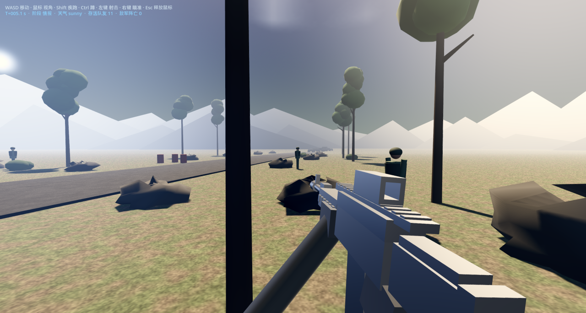 | 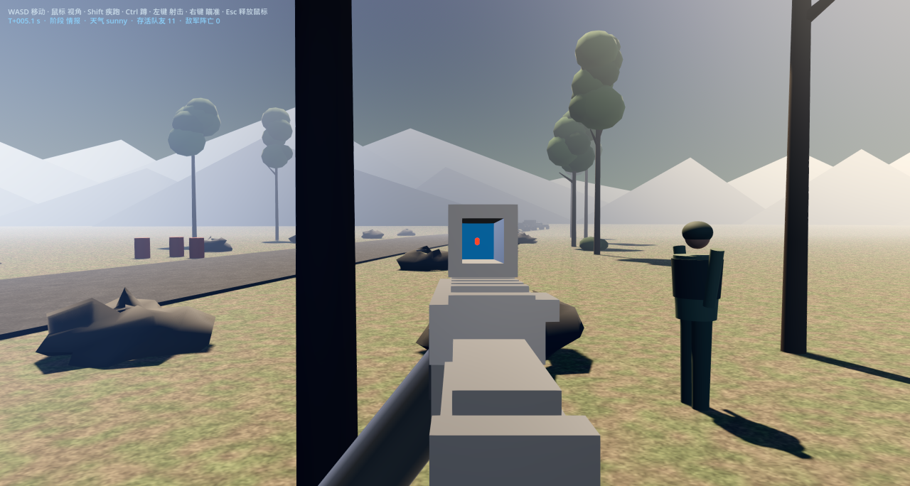 | 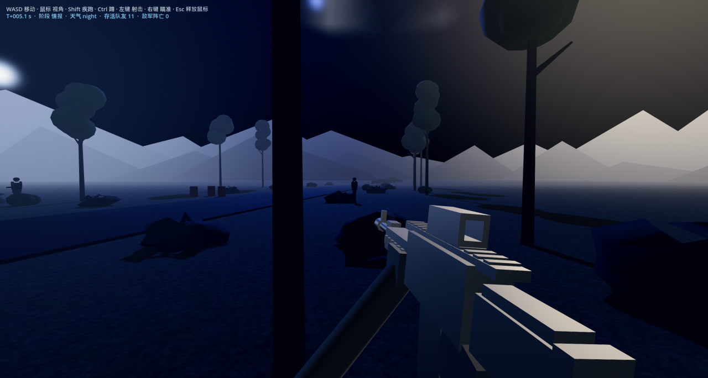 |

> 上图为引擎实际渲染输出（2560×1369 截图降采样），非概念图。
> 生成方式见 [开发工具](#开发工具)：`VA_CAPTURE` 定时截图 + `tools/downscale_png.py`。

---

## 与网页版的关系

同一个游戏，两套实现。三件事**刻意保持不变**：

1. **逻辑层逐函数移植** —— `src/sim/`（16 个文件 / 4261 行）是网页版 `stepOnce` 及其全部子系统
   （关卡、单位、战斗、指令解析、敌我 AI、流程）的 C++ 重写，常数、判定顺序、随机数算法
   （mulberry32）都照抄。天气也是逻辑层概念：`init_world()` 里首个 `RNG.next()` 决定
   `sunny / rain / night`，并且**参与玩法** —— 下雨能见度 ×0.82、夜间 ×0.62，同时受伤倍率上升。
2. **逻辑层不认识引擎** —— `src/sim/` **不 include 任何 Godot 头文件**
   （`grep -l godot src/sim/*` 无输出）。需要播声音、弹字幕、出提示的地方，一律通过 `SimEvents`
   的 8 个虚回调向外抛出。因此逻辑层可以脱离引擎单独跑，也随时换得动渲染后端。
3. **掩体的位置与半径不可改** —— `va_config.cpp` 里 69 个掩体参与视线阻挡（`segCircle`）、
   掩体减伤、AI 找掩体评分。要调整只能改"怎么画"，不能改"在哪、多大"。

## 技术栈

| 项 | 版本 / 说明 |
|---|---|
| 引擎 | Godot **4.5-stable**（Forward+ 渲染器，MSAA 4×，1920×1080 全屏） |
| 语言 | **C++17**（GDExtension 原生扩展） |
| 绑定 | [`godot-cpp`](https://github.com/godotengine/godot-cpp) 固定到 `godot-4.5-stable`（submodule，见 `.gitmodules`） |
| 构建 | CMake 3.17+ / Visual Studio 2022（x64） |
| 产物 | `bin/volunteer_army_pc.dll`（约 900KB） |

## 目录结构

```
VolunteerArmyPC/
├── src/
│   ├── sim/                  逻辑层：零引擎依赖，移植自网页版
│   │   ├── va_types.h            单位 / 载具 / 弹丸 / 指令 / 武器规格
│   │   ├── va_math.h             数值工具 + mulberry32 随机数 + 线段-圆相交
│   │   ├── va_config.*           关卡常数、69 个掩体、公路路径、呼号表、回复语
│   │   ├── va_utf8.h             UTF-8 码点解码（中文语音指令解析用）
│   │   ├── va_grammar.cpp        呼号 / 动作 / 方位语法
│   │   ├── va_parser.cpp         指令解析（三种变体）
│   │   ├── va_world.*            WorldState + 主循环 step_once + SimEvents 接口
│   │   ├── va_level.cpp          关卡初始化、天气抽取
│   │   ├── va_units.cpp          单位状态更新
│   │   ├── va_combat.cpp         弹道、伤害、压制、掩体减伤
│   │   ├── va_commands.cpp       玩家指令下发
│   │   ├── va_ai_ally.cpp        友军 AI
│   │   ├── va_ai_enemy.cpp       敌军 AI
│   │   └── va_flow.cpp           任务目标与关卡流程
│   ├── node/                 桥接层：唯一接触引擎的部分
│   │   ├── world_sim.*           Node3D 主体：输入 → step_once → 同步场景节点
│   │   ├── scene_builder.*       程序化建场景：地形、天空、光照、大气、掩体、士兵、载具
│   │   ├── hud.*                 全套 COD 风格 HUD + 界面外壳（主菜单 / 简报 / 结算），全手绘
│   │   └── viewmodel.*           第一人称武器视图模型（sway / 后坐 / 呼吸 / 开镜 / 换弹）
│   └── register_types.cpp
├── assets/art/               美术素材
│   ├── art_*.png                 任务素材（主菜单 / 简报 / 区域态势 / 结算两张）
│   ├── char/                     角色素材（见「角色形象」一节）
│   │   ├── char_<键>.png             清理版全身立绘（图生3D 与胸像裁切的输入）
│   │   ├── portrait/char_<键>.png    256×332 胸像（简报名册用）
│   │   └── model/char_<键>.glb       三维模型（运行时 GLTFDocument 载入）
│   ├── wpn/                      武器素材（参考图入库，见「武器形象」一节）
│   │   ├── wpn_<键>.png              1776² 白底方图（图生3D 的输入）
│   │   └── model/wpn_<键>.glb        三维模型
│   ├── veh/                      载具素材（参考图**不入库**，见「载具形象」一节）
│   │   ├── veh_<键>.png              1776² 白底方图、车头朝右（图生3D 的输入）
│   │   └── model/veh_<键>.glb        三维模型
│   └── vm/                       第一人称手模（参考图**不入库**，见「双手真模型」一节）
│       ├── vm_hand_r.png             1776² 白底方图（图生3D 的输入）
│       └── model/vm_hand_r.glb       三维模型（**只有右手一份**，左手镜像复用它）
├── ref/                      参考图溯源（来源表 + 授权说明；图本体按情况入/不入库）
├── scenes/Main.tscn          主场景（Node3D "Main" + WorldSim）
├── tools/                    开发工具（截图取证 / PNG 分析 / 素材预处理 / 3D 生成）
├── docs/                     README 配图
├── ext/godot-cpp/            submodule：C++ 绑定，固定在 godot-4.5-stable
├── sdk/godot/                本地 Godot 编辑器（**不入库**，需自行放置）
└── build/  bin/              构建目录与产物（**不入库**，需自行构建）
```

## 构建

### 前置条件

- **Visual Studio 2022**，勾选「使用 C++ 的桌面开发」
- **CMake** ≥ 3.17
- **Python 3**（godot-cpp 生成绑定时要用，需在 `PATH` 里）
- **Godot 4.5-stable 编辑器**，从 [官方 Release](https://github.com/godotengine/godot/releases/tag/4.5-stable)
  下载后放进 `sdk/godot/`，需要这两个文件：
  ```
  sdk/godot/Godot_v4.5-stable_win64.exe
  sdk/godot/Godot_v4.5-stable_win64_console.exe
  ```

### 步骤

```bash
# 1) 克隆。必须带 --recursive —— godot-cpp 是 submodule，
#    漏了它 CMake 会在 add_subdirectory(ext/godot-cpp) 处报目录不存在。
git clone --recursive https://github.com/lujiajingcn/VolunteerArmyPC.git
cd VolunteerArmyPC

# 2) 配置（生成器必须与 VS 2022 匹配；x64 不能省）
cmake -S . -B build -G "Visual Studio 17 2022" -A x64

# 3) 构建
cmake --build build --config Release --parallel

# 4) 运行
sdk\godot\Godot_v4.5-stable_win64.exe --path .
```

构建产物固定输出到 `bin/volunteer_army_pc.dll`，文件名由 `VolunteerArmyPC.gdextension` 引用，**不要改名**。

> ⚠️ **`--config Release` 不能省。** VS 生成器是**多配置**的，此时
> `CMakeLists.txt` 里那句 `if(NOT CMAKE_BUILD_TYPE ...) set(CMAKE_BUILD_TYPE Release)`
> **不生效**（它只管单配置生成器），于是不带 `--config` 时 CMake 会按多配置的默认值
> 走 **Debug**。症状很隐蔽：构建照样成功、游戏照样跑，只是
> `bin/volunteer_army_pc.dll` 从 4.5 MB 悄悄变成 7.3 MB（Debug 的代码 + 调试信息），
> 与既有取证基线不再是同一份产物。要么带上 `--config Release`，要么在 VS 里选好配置。

### 在 VS 2022 里运行 / 调试（F5）

打开 `build/VolunteerArmyPC.sln` 后直接按 F5 会弹：

> 无法启动程序 …\bin\volunteer_army_pc.dll。… 不是有效的 Win32 应用程序。

**这是正常的，不是文件损坏、也不是架构不对。** 本工程的目标是一个 SHARED 库（GDExtension），
它本身不是可执行程序；而 VS 在没有"调试器命令"时，会退而拿**目标的输出文件**去启动 ——
`CreateProcess` 只能启动 EXE，喂给它一个 DLL，报的就是这句话。

CMake 里已经配好了正确的调试方式（`VS_DEBUGGER_COMMAND`），F5 会变成：

```
sdk/godot/Godot_v4.5-stable_win64.exe  --path <工程根> --log-file <工程根>/debug_run.log
```

引擎加载 `bin/volunteer_army_pc.dll`，**断点直接落在我们自己的源码里** ——
GDExtension 没有独立的宿主 EXE，这也是它唯一的本地调试方式。

三个容易踩的点：

| 点 | 说明 |
|---|---|
| 不能指向 `*_console.exe` | 它是 197 KB 的**外壳**（只负责 fork 主 exe 并挂控制台），VS 会附到外壳上，而外壳里没加载我们的 dll → 断点永远绑不上。自动挑选时已排除 |
| 必须有 `--log-file` | 主 exe 是 GUI 子系统，**stdout 无人接收**。不加这个参数，`print` 与 Godot 自己的报错全部丢掉，而本项目的回归判据恰恰是"日志里有没有 ERROR" |
| 想要断点就得选有符号的配置 | `Release` 没有 `/Zi`，能跑但断点打不上。切 `RelWithDebInfo` / `Debug`（首次会连 godot-cpp 一起按该配置重建，耗时是正常的） |

改了 `CMakeLists.txt` 后要**重新生成一次工程**才会写进 `.vcxproj`（VS 会提示"重新加载项目"）：

```bash
cmake -S . -B build -DVA_DEBUG_ENV="VA_SCRIPT_A=1;VA_FF=6"   # 可选：F5 时注入取证旋钮
```

`VA_DEBUG_ENV` 用分号分隔、写进 `<LocalDebuggerEnvironment>`；不设就是空。
不重新生成、只想临时改，也可以走 VS 的「项目属性 → 调试 → 命令 / 命令参数 / 环境」。

### 导出可执行程序（Windows）

```bash
# 前置：本机要有 Godot 4.5 的导出模板（见下"模板从哪来"）
sdk/godot/Godot_v4.5-stable_win64_console.exe --headless --path . \
    --export-release "Windows Desktop" dist/VolunteerArmyPC.exe
```

产物是 `dist/` 下的**两个文件，一起拷走就能玩**：

| 文件 | 说明 |
|---|---|
| `VolunteerArmyPC.exe` | 约 165 MB。导出模板（92 MB）+ 内嵌 pck（`binary_format/embed_pck=true`） |
| `volunteer_army_pc.dll` | GDExtension 库。Godot **不会**把 dll 嵌进 exe，必须与 exe 同目录 |

导出配置 `export_presets.cfg` 已入库，其中 `exclude_filter` 排掉了 `ext/`（godot-cpp 几万文件）、
`sweep/`、`captures/`、`docs/`、`tools/`、`build/` —— 不排的话 pck 会被撑爆。

**模板从哪来。** 导出模板不在仓库里（整包 **1294 MB**），而本机 GitHub release 资产
（走 `objects.githubusercontent.com`）实测 45 秒零字节、完全不通。可用的做法是
**只取需要的那一个条目**：ZIP 的中央目录在文件末尾，配合 HTTP Range 就能先读目录、
再精确拉 `templates/windows_release_x86_64.exe` 的数据段（压缩 33.8 MB，占整包 2.6%），
inflate 后放进 `%APPDATA%\Godot\export_templates\4.5.stable\`。

```bash
python tools/fetch_export_template.py --list   # 先看远端有什么
python tools/fetch_export_template.py          # 下载并装 Windows Release 模板
```

三个坑都写进了脚本注释，这里只点最要紧的：**下载要交给 curl，别用 Python 的 urllib** ——
同一偏移同一镜像，curl 稳定 206 + 精确字节数，urllib 会把整个 1.29 GB 吞进内存
（进程涨到 1.7 GB 且永不返回）。另外加速站要**横向测速**：本机实测
`gh.xxooo.cf` 2.5 MB/s、`gitproxy.mrhjx.cn` 1.8 MB/s，而 `ghproxy.net` 只有 88 KB/s、
`gh-proxy.com` 干脆忽略 Range（任何分段请求都回 200 + 全量）。

### 离线跑逻辑层（`va_sweep`）

CMake 里还有一个**不链接引擎**的目标 `va_sweep`：把 `src/sim/*` 直接编进一个控制台程序，
不开窗口、不走渲染、连 godot-cpp 都不需要。它是「逻辑层可以脱离引擎单独跑」这句话的
**可执行证据** —— 在这之前，README 一直这么写着，但仓库里没有任何东西证明过它。

它也是平衡数据的来源：改一个常数重编一次，就能把 6 套方案 × 10 个种子跑完
（真跑一局是 620 秒模拟时间，手工比十局根本不现实）。

```bash
cmake --build build --config Release --target va_sweep
sweep/sim/va_sweep.exe            # 全部对照方案 × 10 种子
sweep/sim/va_sweep.exe base       # 只跑名字以 base 开头的方案
sweep/sim/va_sweep.exe -v         # 逐局明细（活/亡/倒、坦克、箱、撤离、天气）
sweep/sim/va_sweep.exe campaign   # 六关战役连着跑（见「铁原战役 · 六关」）
```

两个容易踩的点，都写在源文件注释里：① 逻辑层里 `va_flow` 是**直接解引用** `EV` 的
（不像 `va_world` 的 `say/sfx` 走 `ev()` 兜底），无头程序必须 `set_events()`，
否则当场段错误；② 输出要 `setvbuf(..., _IONBF, 0)`，不然崩溃一次就把整轮输出吞掉。

源清单是从 `VA_SOURCES` 里按 `src/sim/` 前缀筛出来的，**不维护第二份清单** ——
两份清单一定会漂。产物落在 `sweep/sim/`（已被 `.gitignore` 忽略）。

> **关于 `.gdignore`**：仓库里 `sdk/.gdignore`、`build/.gdignore`、`captures/.gdignore`、`docs/.gdignore`、
> `tools/.gdignore`、`sweep/.gdignore` 都是**故意保留并入库**的空文件（这也正是 `.gitignore` 里写成
> `sdk/*` + `!sdk/.gdignore` 而不是 `sdk/` 的原因）。
>
> `sweep/` 那条是补上的：它里面存着 `gen3d/char_*.raw.glb`（图生3D 的原始包，**每个 29MB**）。
> 少了这个文件，`godot --import` 会把它们当模型逐个导入 —— 实测一次导入从 7 分钟降到约 20 秒，
> 差值基本就是这 10 个原始包。取证截图也放在 `sweep/` 下，同样不该被当成工程素材。
> 它们让 Godot 不去扫描这些目录 —— 否则首次打开项目时，Godot 会把 `build/` 里 1000+ 个 `.obj`
> 当成 3D 模型逐个导入，卡死数分钟并污染 `.godot/` 缓存。删掉它们会立刻复现这个问题。

## 架构：逻辑层不认识引擎

```
输入（键鼠 / 语音） ──┐
                      ▼
              ┌───────────────┐
              │  src/sim/     │   纯 C++。不 include 任何 godot 头文件。
              │  step_once()  │   持有 WorldState：单位、载具、弹丸、天气、任务进度。
              └───────┬───────┘
                      │  SimEvents（8 个虚回调）
                      ▼
              ┌───────────────┐
              │  src/node/    │   把逻辑状态翻译成场景节点：
              │  world_sim    │   位置 / 朝向 / 动画 / 材质 / 光照 / 视图模型
              └───────────────┘
```

`src/node/world_sim.cpp` 每帧只做三件事：把输入推进 `va::IN` → 调 `va::step_once(dt)` →
按逻辑状态更新场景节点。**它从不反向写逻辑状态** —— 所以任何"画面问题"都不可能污染玩法。

## 实现要点（都是踩过的坑，改代码前建议先读）

- **颜色空间**：Godot 的 `Environment` 与材质颜色在**线性空间**，而选色直觉是 sRGB。
  把网页版的色值原样搬进线性字段会平白亮一大截（0.62 sRGB 当线性用 ≈ 屏幕 0.81）。
  外观色一律走 `scene_builder.cpp` 的 `SRGB()` 包装（内部调 `Color::srgb_to_linear()`）。

- **布光必须跟着天气走**：`apply_weather()` 按 `W.weather` 一次性重打太阳角度/色温、天空、
  雾、体积雾、曝光、饱和、对比、辉光。**漏调它会残留 Godot 默认的 `fog_density = 0.01`**
  （比晴天配方浓 3 倍多），整屏被一层奶白盖住 —— 而且因为所有区域亮度趋同，极易被误判成
  "光照太平"，让人跑去反复调光源（实测就是这么绕了一大圈）。改动环境后**务必先确认 `apply_weather()` 被调用**。

- **峡谷地形：公路在谷底，两侧是上坡**。高度来自一个**纯函数** `ground_h(lx, ly)`
  （`scene_builder.cpp`），地形网格、单位/掩体摆位、相机高度**共用**它 —— 两边各写一份，
  迟早出现"人埋在坡里 / 石头浮在半空"这种只有靠截图才能发现的偏差。
  形状：公路（逻辑 `y=650` → 32.5 米）压在谷底正中，距路心 8 米开始起坡；
  河道（逻辑 `x 306~414` → 15.3~20.7 米）处把两侧谷壁切出一道缺口（水口，桥正好架在上面）；
  峡谷在东西两端收口（否则地形网格边界会出现一道凭空多出来的断崖）。

  ⚠️ **这里有一条必须交代的取舍：地图内的高度被刻意压住了。**
  子弹挡在掩体上靠 `va_combat.cpp` 的 `segCircle` 做 **2D 圆判定、不看高度**，
  而 `passable()` 把单位锁在地图内（`y ∈ [6, H-6]`，即距路心 ≤ 32.2 米）。
  所以在**可走区域**里把地面抬得很高，站在高处的射手就会遇到"瞄准线明明越过了石头，
  子弹却停在石头上"——视线与判定脱节（平地不会有这个问题，因为所有人同一高度）。
  于是剖面把两个高度**拆成两个旋钮**：

  | 旋钮 | 默认 | 位置 | 受什么约束 |
  |---|---|---|---|
  | `VA_TERRAIN_IN` | **4.5 米** | 地图边界（距路心 32.5 米）= 玩家走得到的最高处 | 受上面那条 2D 遮挡约束，脱节幅度被压在 1 米量级 |
  | `VA_TERRAIN_OUT` | **18 米** | 距路心 48 米，**地图之外**，玩家走不到 | 纯背景，只受画面约束；而它就是玩家从谷底看出去的天际线（视高角 ≈ 18°） |

  想更险峻就调大 `VA_TERRAIN_OUT`（只动画面）；要调大 `VA_TERRAIN_IN` 就得同时接受脱节。
  自检：`VA_DBG_TERRAIN=1` 打出剖面参数 + 9 个地标点的地面高度（判据：路心恒为 0、
  `h(32.5)=VA_TERRAIN_IN`、`h(48)=VA_TERRAIN_OUT`、水口中心恒为 0）。取证机位见
  `VA_CAM_H` / `VA_CAM_PITCH` / `VA_CAM_YAW`。


  于是 `sync_entity_nodes` 一开始给包括玩家在内的每个人都建了节点、每帧摆到 `(x, y)` ——
  而**相机就在同一个 `(x, y)` 上、高 1.65 m**，角色模型归一化后高 1.68 m，
  镜头正好落在自己模型的**头里**。症状是"用户视野有大片遮挡"：一大块贴脸的深色面，
  天空只剩左上角一条缝。实测遮挡量 = **44.6% 的像素**（同种子、同帧，
  `VA_SHOW_SELF=1` 与默认各拍一张，`tools/diff_png.py` 逐像素相减）。
  现由 `sync_entity_nodes` 显式跳过玩家自己（`VA_SHOW_SELF=1` 可放回来复现）。
  三点值得记住：
  - 它是**换成三维模型之后**才出现的 —— 之前的图元士兵是个矮块，镜头在它上面，
    所以旧截图（`docs/screenshot-hipfire.png`）里没有这块遮挡，可以直接当"没有遮挡"的基线。
  - 排除"其实是出生点旁边 1~2 米的队友挡的"这个很像的解释，靠的是 `VA_DBG_UNITS`：
    打出来是 `#0 char_leader d=0.00 m self=1`，最近的队友在 3.78 m 之外。
    **一个 1.68 m 的模型在 2 m 处就占满 66% 画高**，所以"贴脸的一大块"必须落到具体对象上才算查清。
  - 检阅台（`VA_UNIT_SHOW`）早就把 `refs_.units` 整个藏掉了，注释里写的理由正是
    "真单位用的是同一批模型，又正好冻在出生点（大多就在玩家身边几米内）" ——
    同一个根因，那里是靠连队友一起藏才绕过去的。

- **"按住不放"与"松开"是两回事：按键重复不是 key-up**。逻辑层只有"键现在按不按着"
  一个概念（`va::IN` 里全是 bool），而引擎侧的事件有三类：按下 / **系统按键重复** / 松开。
  重复事件（`InputEventKey::is_echo()`）的 `is_pressed()` **仍然是 1**，它说的是
  "键还按着"。原来那行 `const bool down = k->is_pressed() && !k->is_echo();`
  把它当成了松开，于是**按住方向键只走 0.53 秒**（Windows 默认重复延迟 500ms），
  之后一直到手指真的抬起来都不动 —— 表现为"按着没反应、只能反复点"。
  实测（`tools/inject_key.py` 注入 + `VA_DBG_INPUT` 逐事件打点）：

  ```
  6.4s pressed=1 echo=0 → IN.w=1     随后两条心跳位移 11.733 / 23.467 m
  ≈7.0s pressed=1 echo=1 → IN.w=0     ← 被自己的重复事件按停
  7.0~8.4s 共 30 条 echo=1 → 位移 0.0 m
  ```

  现在 echo 不写任何状态；**只在"闩锁刚被清过"时**才用它把"键其实还按着"补回来 ——
  那种情况下真正的 press 事件压根没送到过，echo 是唯一的线索。
  开关类键（R 换弹 / G 手雷 / F 烟雾 / Z 标记）**绝不允许**被 echo 重建：
  多补一次按下等于多打一枪、多丢一颗雷（`is_hold_key()` 划这条线）。

- **丢 keyup 的三条路径必须一起堵**（否则症状正好相反：**角色自己一直往那个方向走**）：
  ① **窗口失焦** —— Windows 把 keyup 送给了抢走焦点的那个窗口，本进程永远收不到；
  ② **界面外壳** —— `_input` 在外壳期间整条 return，release 也一起被吃掉
  （战斗里按住 W 再进菜单松手，`IN.w` 会永远停在 true）；
  ③ 失焦通知万一来不到 —— `_process` 每帧核对一次窗口焦点兜底。
  三条都归到 `clear_held_input()`，`p_reacquire_ok` 区分它们：
  失焦后允许 echo 把键态补回来（键可能真的还按着），**进菜单则不允许**
  （菜单里的 W 不能变成"一进场就自己往前走"）。
  失焦那条的实测很干净：事件表里**只有一条 keydown、一条 keyup 都没有**，
  闩锁在失焦那一刻归零，之后 60 多条心跳位移全是 `0.0 m`。

- **视图模型必须独立打光**：枪模单独占一个渲染层（`set_layer_mask(1u<<1)`），配几盏
  `set_cull_mask(VM_LAYER)` 的平行光，这样玩家任意转向，枪身明暗都稳定可读，又不会照亮身边的石头。
  其中**沿视轴的兜底光是必需的** —— 前臂圆柱的可见面法线几乎全朝向相机，只给侧向光时
  那些像素照度恒为 0（把 albedo 提高 2 倍都不会变亮）。

- **视图模型姿态用投影反推，不要试数**：先算"枪要在屏幕上落在哪几个点"，再反推几何。
  另有硬约束：**枪上任何顶点都不能落到相机后方**，否则会被近裁剪面切开、透视放大成占屏近一半的木板。

- **坐标系映射**：逻辑层 2D `(x, y)` → Godot `(x * S, 高度, y * S)`，其中 `S = 0.05`
  （1 世界单位 = 0.05 米，即 1 米 = 20 单位）。公路宽 140 ≈ 7 米，眼高 1.65 米。

- **模型旋转约定**：逻辑层「模型前方 = +X」→ Godot 绕 Y 轴旋转角 = `-facing`；
  相机 `yaw = -facing - π/2`。

- **日志里的中文必须走 `String::utf8()`**：godot-cpp 的 `String(const char *)` 绑定的是
  引擎的窄字符构造，那是按 **Latin-1 逐字节取码点**的。源文件是 UTF-8，"取证" 的
  `E5 8F 96` 会被读成三个 Latin-1 字符，写进日志再按 UTF-8 编码 → `C3A5 C28F C296`，
  也就是**二次编码**的乱码：`åè¯æ³¨å`。只有 `String::utf8()` 才按 UTF-8 解释。

  ```cpp
  // 错：日志里是 åè¯æ³¨å¥
  UtilityFunctions::print("[combat-ev] 取证注入：自动战斗=", autoplay_ ? "开" : "关");
  // 对
  UtilityFunctions::print(String::utf8("[combat-ev] 取证注入：自动战斗="),
                          autoplay_ ? String::utf8("开") : String::utf8("关"));
  ```

  编译期完全不报错，只能靠 `tools/check_log_encoding.py` 兜住
  （扫 `src/**/*.cpp` 的日志调用参数表，有发现退出码 1）：

  ```bash
  python tools/check_log_encoding.py
  ```

  注意它只管**日志调用**。别处的非 ASCII 窄字面量是合法的、不能乱包 ——
  例如 `va::W.overKind = "成功"` 是赋给 `std::string` 的字节透传，包了类型都不对。

- **诊断日志要看编码**：同一条日志在三种输出通道下字节可能不同，
  别把"乱码"当成引擎 bug。判定方法是对原始字节做十六进制看：
  `取` 的正确 UTF-8 是 `e5 8f 96`，二次编码则是 `c3 a5 c2 8f c2 96`。

## 开发期旋钮

全部靠环境变量控制，**无需改代码、无需重新编译**。这在做视觉 A/B 对照时极其省时间
（本轮标定枪模光照时靠它扫了 6 档能量，只编译过一次）。

| 旋钮 | 作用 |
|---|---|
| `VA_SEED` | 固定随机种子（同时决定天气与敌军部署）。不设则用系统 tick |
| `VA_TRACE` | 打开逻辑层追踪输出 |
| `VA_FOV` | 世界相机视场角（默认 65，垂直） |
| `VA_ADS` | 强制进入开镜状态（截图取证用）。**它同时驱动枪的姿态与 HUD 的准星规则** —— 早先只喂给 `ViewModel::update` 的 `ads` 形参、`va::IN.ads` 不动（那样写会污染 `VA_DBG_INPUT` 的输入取证），结果强制开镜的图里"枪进了开镜姿态、准星却按腰射规则照画"，拿它验准星规则必然得出错结论。现在 WorldSim 把同一个标志同步给 HUD（`Hud::set_force_ads`） |
| `VA_CAPTURE` / `VA_CAPTURE_DIR` | 到指定战局秒数自动截图，全部拍完自动退出 |
| `VA_SCREEN` | 指定初始屏 `menu` / `brief` / `play`（优先级高于"取证模式自动跳过前奏"，否则新屏永远拍不到） |
| `VA_SKIP_MENU` | 跳过主菜单直接开打 |
| `VA_END` | 把战局按指定结局收尾 `win` / `lose`（给结算面板取证，不必真跑满一局） |
| `VA_UNIT_SHOW` | **模型检阅台**：`1`/`row` 角色陈列排、`one:<键>[:<度>]` 角色近景单体；`veh:<键>[:<度>]` 载具近景、`veh:row` 载具陈列排（见「载具形象」那节） |
| `VA_AUTO` | **自动战斗**（取证/回归）：每帧朝最近活敌对准并按住开火。命中的判定、`hits`/`kills` 自增、伤害与死亡全走真实战斗代码 —— 它顶替的是玩家的手，不是 HUD 的状态 |
| `VA_SCRIPT_A` | **按离线扫描同一套剧本发口令**：`全体，隐蔽` → `老白，起爆`（先头车 `x < 1180`，按位置）→ `全体，开火` → … → `全体，撤离`。它是 `VA_AUTO` 的**补充而不是替代**：`VA_AUTO` 只顶替玩家的手，而**伏击是由"第一枪"触发的**，车队不进射界就永远没有第一枪 —— 整局会以「车队冲过了西侧出口，伏击失败」收场（实测踩到过，那时画面上一条命中都没有，看着像命中判定坏了） |
| `VA_DOWN_AT` | 到指定战局秒数让玩家被**真实伤害**击倒（走 `damage_unit` → `down_player`，不是把 `downed` 置 true） |
| `VA_FF` | **快进倍率**（默认 1）。逻辑层按真实经过时间推进，而车队要到 `CFG.convoyIn = 175` 秒才进地图 —— 不打快进的话，"打到交火"的取证跑图就是 5 分钟真实时间起步。它只放大"喂进来的时间"，步长仍是固定 1/60，所以同一战局秒数下的状态与不快进时一致。**但标称倍率在 1080p 下会被削**：每帧最多跑 `8 × 倍率` 个固定步（= 0.8 秒仿真/帧），帧率跟不上时就地触顶 —— 报告里别把它当实测值写 |
| `VA_CAPTURE_EV` | **战斗事件当帧自动落盘**：命中标记只亮 0.24 秒，定时截图撞不上，改由事件自己声明"该留证据了"。落盘时机是**等 0.05 秒墙钟 + 至少跨 1 帧**（不是"隔 N 帧"），理由与判读方法见下节 |
| `VA_HUD_EV` | 把命中/击杀/队友阵亡/倒地的**触发时刻**打成 `[hud-ev]` 日志（把"事件什么时候发生"变成可读的数字） |
| `VA_MODEL_YAW` | 覆盖三维模型的朝向校正角（默认 90°），现场调朝向用 |
| `VA_VEH_YAW` | 覆盖**载具**模型的朝向校正角（默认 **0°**，见「载具形象」那节的实测），现场扫角度用 |
| `VA_TERRAIN` | **峡谷地形总开关**（默认开）。写 `VA_TERRAIN=0` 时地形网格不建、地板也回到 `h=0` —— 与改动前逐像素一致，A/B 对照靠它 |
| `VA_TERRAIN_IN` | **地图内最高点**的高度（米，默认 **4.5**），出现在地图边界（距路中心 32.5 米）处。这是玩家真的走得到的最高点，所以它受"2D 子弹遮挡"约束（见「峡谷地形」那节），调大要接受视线与判定脱节 |
| `VA_TERRAIN_OUT` | **谷壁峰值**高度（米，默认 **18**），出现在距路中心 48 米处 —— **地图之外**，玩家走不到，纯背景，但那就是从谷底看出去的天际线。只动画面，**不受上面那条约束** |
| `VA_TERRAIN_BUMP` | 谷壁横向起伏强度（默认 **0.35**）。`0` = 完美的棱柱（一眼假），调大更自然但坡面更乱 |
| `VA_TERRAIN_GORGE` | 河道处是否开缺口（默认开）。关掉则河被整条埋进谷壁里 —— 留它是为了给"水口"这一处做 A/B |
| `VA_CAM_H` `VA_CAM_PITCH` `VA_CAM_YAW` | **取证机位**：在眼高之上再抬多少米 / 强制俯仰 / 强制偏航（`0`=朝北=路的北侧，`-90`=朝东=车队来向）。峡谷这种尺度站在谷底一张全貌都拍不到。⚠️ 只覆盖相机变换，**不写回** `va::W.viewPitch` / `IN.*`（与 `VA_ADS` 同一条纪律）；所以强制俯仰时"子弹有效射程"仍按玩家真实视角算，别拿这种图验证命中率 |
| `VA_HIDE_HUD` `VA_HIDE_PROPS` `VA_HIDE_UNITS` `VA_HIDE_VEH` | 分层消融：判定"画面上这块到底属于谁"（**归属问题一律用消融答，不用眼睛答**） |
| `VA_DBG_UNITS` | 把"镜头最近的 6 个单位"打成数字（编号 / 模型键 / **水平距离** / 是否在画 / 是不是自己）。消融只答到"属于哪一层"，它才能答到"具体是哪一个"—— 见「第一人称不渲染自己的身体」 |
| `VA_DBG_HUD` | 把**准星这一帧画不画、为什么**打成一行 `[hud]` 日志（开镜 / 枪上有瞄具 / 真模型 → 让位或保留 + 屏幕中心坐标），仅在结论变化时打。**用来看截图判不了**：准星（中心圆点 + 四条**正交**短线）和命中标记（四条 **±45° 斜线**）在低分辨率下几乎一样；而跨运行截图差分会被"仿真跟墙钟走"的时序差异整片淹掉（实测全屏差异 17%，信噪比为零） |
| `VA_SHOW_SELF` | **把玩家自己的身体画回来**。这不是画面风格开关，是**复现"视野被大片遮挡"**用的（放回来 = 镜头被自己的模型包住） |
| `VA_DBG_INPUT` | **逐事件打印按键流**（键码 / `pressed` / `echo` → 写进 `IN` 的结果）**+ 每 0.25 秒墙钟一次位置心跳**（含两次心跳之间的**位移**）。输入手感问题只看画面判不了："走得慢"和"走两步就停"在屏幕上读不出量级。判据两条：`echo=1` 那行之后的 `IN(w,s,a,d)` 必须**不变**；`位移=0.0 m` 只能出现在 release 之后 |
| `VA_NO_AO` / `VA_NO_SHADOW` | 关掉环境光遮蔽 / 阴影，量化各层对画面的贡献 |
| `VA_TONEMAP` | 色调映射：`aces`（默认）/ `agx` / `filmic` / `reinhardt` |
| `VA_EXPOSURE` `VA_SUN` `VA_FILL` `VA_BOUNCE` `VA_AMBIENT` `VA_FOG` `VA_LUT` | 曝光 / 主光 / 补光 / 弹光 / 环景光 / 雾 / 色调分级 LUT 的倍率（默认 1.0 = 完全按天气配方） |
| `VA_VMK` `VA_VMF` | 枪模关键灯 / 侧补光的能量倍率 |
| `VA_VM_HIP` `VA_VM_AIM` `VA_VM_ROT` | 覆盖枪模腰射位 / 开镜位 / 姿态角 |
| `VA_VM_HIDE` | 隐藏枪模（做"有枪 / 无枪"消融对照） |
| `VA_VM_MAT` | 给枪模各部件上识别色（红=枪身 绿=手套 蓝=袖子 白=金属），用于定位几何体。⚠️ 识别色材质是 unshaded，但**色调映射仍在它之后生效**：`Color(0,1,0)` 实测渲染成 `RGB(192,240,112)`（淡黄绿）、`Color(0,0,1)` 渲染成 `RGB(16,0,240)`。所以判据必须按**实测渲染色**写（`g > r+30 且 g > b+60`），照材质常量写（`g > r+60`）会漏掉 97% 的手套像素 —— 详见 `tools/vm_hand_probe.py` |
| `VA_WM_SKIN` | **武器外观**：`<键>`（`wpn_mosin` / `wpn_ppsh` / `wpn_dp27`）或槽位序号，指定开局拿哪一把。取证靠它一条命令拍完三把，不必依赖按键注入 |
| `VA_VM_NO_ART` | 强制用程序化枪模（真模型武器的那一半消融对照） |
| `VA_VM_HANDS` | 双手与前臂。**默认显示**；只有写 `VA_VM_HANDS=0` 才藏（消融对照用：同种子同秒拍两张，逐像素之差就是"双手到底占了哪些像素"）。⚠️ 语义在接真模型之后反转过一次：原先写成 `getenv(...) != nullptr` → 不设就藏，直接表现为"玩家视角下只有一支枪，没有手" |
| `VA_VM_GLOVE` `VA_VM_SLEEVE` | 手套 / 袖子的 albedo 标量（默认 **0.540 / 0.330**，色相在代码里固定为皮革棕 / 军装卡其）。只被双手用到，所以扫它们对枪的影响恒为 0（11 次扫描里枪身始终在 **L143**、过曝 **25.1~25.3%**，与基线逐位相同）。⚠️ **袖子在 2026-09-19 从 0.500 压到 0.330**：支撑前臂在腰射画面里是一条 423×150 px 的带子，占屏面积比枪管还大；0.500 时它渲染成 L88 的暖卡其 —— 画面下半部**最亮的大块**，眼睛先看到"一根亮柱子"再看枪。参考图里那条前臂一律是**暗色剪影**，压暗之后才退回"支撑物"的位置 |
| `VA_VM_SCALE` | 视图模型整体缩放（默认 **0.620**，允许 0.30~1.60）。它和 `VA_VM_HIP` **必须一起调**：整体乘 s 再把 `hip_pos` 也乘 s 是一个相似变换，屏幕上分毫不变 —— 真正决定观感的只有"眼睛在枪局部系里的位置" `Z0 = -hip_pos.z / vm_scale`。s 的作用是让"枪相对人有多大"可变，从而在不撞近裁剪面的前提下把 Z0 压下来（真模型全长 1.232 m，照 0.748 m 的姿态摆会把支撑手顶到眼前 0.78 m） |
| `VA_VM_AIMDIST` | 开镜时枪托尾端到眼睛的距离（米，默认 **0.200**，允许 0.06~0.60）。开镜落点不是写死的坐标，而是 `(-照门.x·scale, -照门.y·scale, -aim_dist)` 反推出来的 —— 这样枪**自己的照门**正好压在屏幕中心，三把枪通用 |
| `VA_VM_ARM_W` `VA_VM_ARM_E` | 前臂**腕端 / 肘端**半径（米，默认 **0.0215 / 0.030**）。腕端的口径是"屏幕上的绝对宽度"：0.026 → 直径 5.2 cm → 在 0.374 m 处折合 149 px（屏高的 11%）。⚠️ 肘端**不能跟着放大**：投影宽度 ∝ r/深度而肘更深，肘一粗，画面下沿反而比腕部更宽，读成"下粗上细的喇叭口"。两个数越界（写错）会**退回默认**而不是照错值算 —— 视图模型一个越界的数就能让枪撞进近裁剪面，症状与"位置不对"看不出关系 |
| `VA_DBG_VM` | **视图模型的时序取证**：每秒一行 `[vm] dt …s ≈ N fps`，并在每次枪口焰结束时打 `[vm] 枪口焰 结束：亮 N 帧 最大帧间隔 …`。0.045 秒的闪光**肉眼、定时截图、事件落盘三种手段都抓不住**（事件落盘要等 0.05 秒墙钟 > 0.045 秒），"到底画没画出来"只能靠"亮了几帧"回答 |
| `VA_VM_FLASH` | `VA_VM_FLASH=<秒>` 按住枪口焰（默认 0.045，允许 0.005~60）。**只为取证**：把一张原本注定拍不到的图变成拍得到。拍法见「开火时的枪口焰」那节，游戏里永远用默认值 |
| `VA_VM_ART_ALB` `VA_VM_ART_METAL` `VA_VM_ART_ROUGH` | 真模型材质的三个标定旋钮（默认 0.42 / 0.12 / 0.40）。图生3D 给的是**给离线渲染器看的** PBR（albedo 1.0 / metallic 1.0 / roughness 1.0），不改造就会过曝 + 缺反射探针发黑 |
| `VA_VM_ART_QUIET` | 关掉真模型材质参数的一次性打印 |
| `VA_WPN_ROT` `VA_WPN_LEN` `VA_WPN_PLACE` | 覆盖单把武器的姿态角 / 全长（米）/ 落位微调，现场标定用 |
| `VA_VM_HAND_ART` | 双手用不用真手模。**默认用**；只有写 `VA_VM_HAND_ART=0` 才回退程序化图元（消融对照：`docs/vm_hands.png` 上排那两张）。回退链与枪/载具/角色同构 —— 少一个 `.glb` 不该让玩家手里没手 |
| `VA_VM_HAND_ROT` `VA_VM_HAND_LEN` `VA_VM_HAND_PLACE` | 手模的**残余朝向角**（度，"俯仰,偏航,侧倾"，在模型自己的坐标系里）/ 手长（米）/ 落位微调（米）。一次改两只手，扫档用。⚠️ 默认的 `4.1,20.2,48.5` 不是扫出来的、是**解出来的**（"腕端指向肘、手背指向相机"，回代误差 2.2e-16）；手拧的数能看着还行，但换枪时握持点一动就散 |
| `VA_VM_HAND_R_*` `VA_VM_HAND_L_*` | 同上的**键级版本**（`ROT`/`LEN`/`PLACE`，左手把 `R` 换成 `L`），**优先于全局**。是**重标定工具**：模型是"握拳 + 一截腕柱"，包围盒中心落在腕柱上，两只手的容错空间不等。本轮扫 8 档（4 朝向 × 4 落位）的结论是**两只手同值最优**，但换手模/换握持点之后要能分开校 |
| `VA_VM_HAND_TINT` `VA_VM_HAND_METAL` `VA_VM_HAND_ROUGH` | 真手模的材质参数（默认 `0.50,0.42,0.36` / **0.0** / **0.88**）。⚠️ `TINT` 是**按 sRGB 给的色相乘数**，与枪的 `VA_VM_ART_ALB`（线性标量乘数）**单位不同、不能混用**。手只乘色调、**不压成灰** —— 贴图上的指节褶皱/掌纹/指缝阴影是"这是一只手"的全部信息来源 |
| `VA_VM_HAND_NOMIRROR` | 借来的手模**不做左右镜像**，A/B 用。判定"左右手亮度不一样"到底是镜像翻了法线、还是那只手本来就更背光 —— 实测两者几乎逐位相同，见「双手真模型」那节 |
| `VA_VM_ADS_HSHRINK` `VA_VM_ADS_HOFF` | **开镜时双手的让位量**：缩小比例（默认 **0.65**，0~0.85）与位移（默认 `0.06,-0.04,0.02` 米，枪局部系）。真手模在实尺下会**两只手一起压住照门**（开镜时枪轴与视轴重合），落位修不了 → 照真 FPS 的做法给视图模型分腰射/开镜两套姿态。腰射时 `ads = 0`，缩放 1、位移 0，**构造保证**不改画面 |

例：固定种子拍夜战

```bash
VA_SEED=3 sdk/godot/Godot_v4.5-stable_win64.exe --path .
```

## 玩法平衡（数字是离线扫描量出来的，不是感觉出来的）

**起点**：网页版记录的是「10 种子胜率 4/10，车顶机枪占我方伤亡 33%–59%」。
把量测搬进 `va_sweep` 后第一步不是调参，而是**先验证基线**：
`base`（= 改动前的原值）跑出 **3/10**、车顶机枪占我方伤亡 **66%** ——
比网页版更差。基线对得上，后面的"变好了"才有意义。

三套候选方案各跑 10 个种子（同种子表、同剧本）：

| 方案 | 胜率 | 全灭局 | 我方伤亡 | 其中车顶机枪 |
|---|---|---|---|---|
| `base` 原值 | 3/10 | 1 | 71 人 | 66% |
| **A 削弱车顶机枪**（伤害 ×0.55、射击间隔 ×1.80） | **8/10** | 1 | **36 人** | 72% |
| B 提高队友耐久（生命 ×1.40） | 3/10 | 0 | 56 人 | 82% |
| C 降低撤离门槛（6 人 → 5 人） | 3/10 | 1 | 71 人 | 66% |
| A+B | 8/10 | 0 | 26 人 | 73% |
| A+C | 8/10 | 2 | 41 人 | 68% |

**结论：车顶机枪是唯一瓶颈，只采用 A。**

- **B 减伤不加胜场**：伤亡 71 → 56、全灭局 1 → 0，但胜率一动没动。
  说明队友不是"赢得不够"而是"赢的条件里没有他们"。
- **C 完全无效**：胜率、伤亡总数、全灭局三项与 `base` 逐项相同 ——
  6→5 这个门槛**没有卡住过任何一局**，它调的是一个从未生效的约束。
- **A 单独就已经到顶**：再叠 B/C 都停在 8/10，只是在同一个上限下面换伤亡分布。
  A+B 的 26 人看着最漂亮，代价是多引入一个平衡旋钮去换"更耐打"而非"更容易赢"，
  不值。**一个根因、一个杠杆。**
- A 之后车顶机枪的**占比**反而升到 72%：分母（总伤亡）掉得比它自己快。
  它仍然是第一威胁，只是量级下来了 —— 这和"根因还能再优化"是两件事。
- 掩体位置与 `p.r` **一行未动**（这是硬约束，动了等于重做关卡）。

三个旋钮收在 `va_config.h` 的 `BalanceCfg BAL` 里，默认值就是 A。
`va_sweep` 的方案表里有一行 `BAL 默认`：它不覆盖任何参数、直接读默认值，
**那一行的数字必须与 `A-mg` 完全相同** —— 否则就是"扫描报告"和"实机行为"分了家，
而这种分家不会有任何报错来提醒你。

## 铁原战役 · 六关（一个阵地打完了，带着人撤向下一个）

单关卡是"一局"，战役是"一条线"。六关全部取自 `铁原阻击战阵地数量.txt` 里列出的阵地，
挑的是**战斗形态各不相同**的六场：前哨遭遇 → 山口坚守 → 昼失夜夺 → 迟滞掩护 → 孤点抗击 → 炸坝断后。

关卡数据集中在 `src/sim/va_campaign.cpp` 的 `L1..L6`（`LevelDef`）：
**加一关就是加一个 `LevelDef`，`src/node/` 一行不用动。**
`init_world(seed, levelIdx, carry)` 里 `levelIdx < 0` 表示"不走战役"（离线跑测与旧基线走的就是这条路），
只有 `>= 0` 才 `CAM.active = true` 并 `apply_level()`。**默认单关卡 = 第 1 关**，旧基线仍然可比。

### 六关一览

| 关 | 阵地 | 日期 | 主目标（全部达成才转进） | 撤离门槛 | 集结窗口 |
|---|---|---|---|---|---|
| 1 | 玉女峰前哨 | 1951.5.30 | 打掉敌搜索队的装甲车 · 撤回下浦渡口 | 7 | **42 s** |
| 2 | 涟川山口 | 1951.6.1 | 守住山口（累计 150 s）· 打瘫两辆车（坦克最好）· 撤出战斗 | 6 | 40 s |
| 3 | 种子山 233.2 高地 | 1951.6.2 — 6.3 凌晨 | 白天拖住敌人（90 s）· **夜袭夺回种子山主峰** · 撤出战斗 | 5 | 40 s |
| 4 | 加齿项 477.2 高地 | 1951.6.3 | 拖到天黑（260 s）· 带出师部电台 · 撤向二线阵地 | 5 | 40 s |
| 5 | 207 高地 | 1951.6.5 — 6.6 | 守住 207 高地（180 s）· 带出连队花名册 · 撤向二线阵地 | 4 | **36 s** |
| 6 | 内外加山 279.5 高地 | 1951.6.9 — 6.10 | **炸开水库大坝** · 把装甲集群钉在原地（200 s）· 撤往铁原以北 | 3 | 38 s |

表里的"撤离门槛"是**关卡显式值**；实际生效的是 `effective_evac_need()` =
`min(显式值, 开局人数 − 3)`，下限 2（见下"门槛必须浮动"）。
"集结窗口"是每一关自己的 `LevelDef::evacWindow` —— 为什么每关不同、为什么不能是 0，见下"收拢窗口"。

八种目标类型（`GoalKind`）：`Hold`（我方 ≥ 敌方的累计秒数）/ `Delay`（撑到时限）/
`DestroyKind`（打掉指定车型）/ `DestroyAny`（打掉任意 N 辆）/ `BlowDam` / `Retake`（夺回阵地）/
`ExtractItem`（带出物件）/ `Evac`。**主目标可以给"替代路径"**：第二关原本要求"必须敲掉坦克"，
但 950 HP / 装甲 0.04 的坦克只有火箭筒啃得动，而反坦克组一共 6 发还要穿过车顶机枪火网 ——
实测真人剧本打掉它的概率约 8/10，**每五局就有一局因运气整关判死，那是赌博不是难度**。
改成"打瘫两辆车（坦克最好）"后，打掉坦克仍是最优解，但打不到时还有一条路。

### 每一关都是史实里的一个阵地

- **第一关 · 玉女峰前哨**：187 师进入阵地当夜即派警戒分队前出 20 公里骚扰，迫使美军于 6 月 1 日
  提前展开进攻，为军主力抢修工事抢出一天。
- **第二关 · 涟川山口**：561 团 3 营坚守四天三夜，抗击数倍之敌十余次进攻，毙伤美军 1300 余人，
  战后被授予「守如泰山」锦旗。
- **第三关 · 种子山**：6 月 2 日激战竟日，种子山、五峰寺及以南阵地相继失守；当夜 566 团以一连、
  三连各一个排组成敢死队，3 日凌晨夜袭种子山，全歼守敌夺回阵地。
- **第四关 · 加齿项**：6 月 3 日拂晓美 25 师 3 个团加入战斗，以坦克为先导突入纵深；189 师
  战斗减员严重，坚守到天黑才奉命把阵地移交给军预备队 188 师。
- **第五关 · 207 高地**：6 月 6 日敌以一个营分两路迂回，563 团 1 连 2 排三面受敌、背后是悬崖，
  战至午夜只剩 8 人，弹药耗尽后高呼「胜利属于我们」跳下悬崖 —— 5 人牺牲、3 人被树枝托住生还，
  后称「宁死不屈的八勇士」。
- **第六关 · 内外加山**：6 月 10 日晨 5 连自断退路炸开水库，"水淹七军"令敌坦克陷入洪流；
  美军出动飞机 707 架次倾泻凝固汽油弹，山体被打得像融化的冰淇淋（当地人称「冰激凌山」）。
  5 连以全部牺牲的代价，把一个 200 多米高的小山包守了一整天。

第六关是六关里唯一"目标本身就要付代价"的一关：炸坝的目标文本、简报、`LevelDef` 注释
都把话说明白了 —— **山上的人再也退不回来**。那一关的撤离门槛（3 人）是六关里最低的。

### 跨关继承：只建活下来的人

`CarryOver` 只装**存活者**（玩家恒存在，哪怕倒地），hp / 弹药 / 士气 / 倒地状态**原样带走**，
阵亡的不复活。所以第一关带走多少人，直接决定第二关的底子 —— 这不是装饰，是那条线的主承重。

配套的两条口径：

- **门槛必须浮动**。固定门槛会在"前几关打得太惨"时变成**不可达**：第五关要求撤出 4 人，
  可如果队伍带进来就只剩 3 个人，这一关无论怎么打都赢不了，而玩家看不出是为什么。
  所以实际门槛永远是 `min(关卡值, 开局人数 − 3)`，下限 2。
- **撤离门槛不是唯一的胜利条件**，但"没带够人"要能分辨是"没打成"还是"没带出来" ——
  这是两件事，失败文案分开写（`"未能守住"` vs `"撤出来了，但任务没完成"`）。

### 收拢窗口：过关 ≠ 立刻收关

主目标全达成的那一刻，**队伍往往散在阵地上**。旧行为是就地收关 —— 结果第一关
只带出 8/11 人，第二关对着美骑 1 师当场崩掉。现在收关前有一个**收拢阶段**：

- 进入条件：非撤离类主目标**全部达成**，**且**（玩家下过撤退令 **或** 撤离人数已经够）。
- 退出条件：窗口走完（`LevelDef::evacWindow`，36~42 秒）**或** "能走的都到了"（`allIn`）。
- **时限不在这个阶段判死** —— 否则"已经打赢了却因为收拢超时判负"。

窗口秒数是量出来的：从阵地走到撤离点约 30 秒，所以窗口必须大于 30；第一关给到 42 秒
（对面只是搜索分队，火力压不住人），第五关只有 36 秒（三面受敌，侧翼火力不会给你慢慢等人的时间）。

这里有一个**踩过两次的区分**：`W.evacArmed`（"拿到撤离条件"）与 `W.evacOrdered`（"玩家明确下过撤退令"）
不是一回事 —— 第三关为了拿密码箱也走同一条通路，用 `evacArmed` 当"该收拢了"的判据，
会让窗口在物件刚到手时**就开完了**；而机械剧本更狠：313 秒下了撤离令，
322 / 342 秒又被夜袭循环一句"全体，前往A点"叫回主峰，40 秒窗口里**没有一个人往撤离点走**。
两条都修了（判据拆开 + 撤离令优先级压过后续回派），第三关才从"0 人撤离"变成"7 人撤出"。

### 打输了会怎样

- **转进**（这一类不算输）：这一关打下来了、还有下一关。结算面板写"按 R 转进下一阵地"，
  **不显示 S/A/B/C 徽章** —— 战役还没打完，不该给一个终局的评分。
- **失败**：结算面板写"按 R 重打本关"，Esc 回主菜单。
- 六个"转进"里最后一个特殊：第六关之后没有下一关，落点是史实的 6 月 12 日 19:30
  "63 军奉兵团命令转向伊川地区休整"。

有一处自相矛盾是**实机截图抓出来的**：过关了，标题却写「任 务 失 败」，底部又写"按 R 转进下一阵地"。
根因是 `score_mission()` 里算评级的 `win`（含"转进"）与喂给 HUD 的 `finalWin`（只认"胜利/成功"）
不一致 —— 同屏两个相反结论。现在统一成 `W.score.win = win;`。
**这种矛盾离线跑测抓不到**（离线没有 HUD），只有真跑一遍才看得见。

### 实测：六关链一次跑完

`VA_CAMP_FORCE=1` 让机械剧本打输了也往下走（**只是链路验证开关，不是玩法**），
这样六关的机制都能被跑到：

```
关  阵地                 结果  活  亡  倒  撤  带 用时  目标
1    第一关 · 玉女峰前哨 转进   10    1    0    9   10   218s  [√]打掉敌搜索队的装甲车 [√]撤回下浦渡口
2    第二关 · 涟川山口 失败    5    4    1    5    -   384s  [√]守住山口 [√]打瘫两辆车（坦克最好） [ ]撤出战斗
3    第三关 · 种子山 失败    3    3    0    3    -   402s  [√]白天拖住敌人 [ ]夜袭夺回种子山主峰 [√]撤出战斗
4    第四关 · 加齿项 全灭    0    2    2    0    -   248s  [ ]拖到天黑（交给 188 师） [ ]带出师部电台 [ ]撤向二线阵地
5    第五关 · 207 高地 全灭    0    2    0    0    -   246s  [ ]守住 207 高地 [ ]带出连队花名册 [ ]撤向二线阵地
6    第六关 · 内外加山 全灭    0    1    0    0    -   249s  [ ]炸开水库大坝 [√]把装甲集群钉在原地 [ ]撤往铁原以北
```

**这张表就是"严格继承"的代价，它是有意的：** 机械剧本第一关带走 10 人，第二关打到只剩 5 人，
第三关 3 人，第四关 4 人（含倒地）…… 到第六关**场上只有 1 个人**，而炸坝需要 8 个安放位。
真人玩家比机械剧本强得多（离线数据里真人剧本打掉坦克约 8/10，机械剧本只有一次口令、不会集火），
但只要选了"严格继承"，减员就会滚雪球 —— **这不是 bug，是那条规则本身的样子**。
单关机制因此另有验证入口（后三关在链里必然测不到）：

```bash
sweep/sim/va_sweep.exe campaign                  # 从第一关连续跑
sweep/sim/va_sweep.exe campaign 101              # 换种子
VA_CAMP_START=5 sweep/sim/va_sweep.exe campaign  # 单独验第六关（队伍按满编起算）
VA_CAMP_FORCE=1 sweep/sim/va_sweep.exe campaign  # 输了也往下走，链路验证
```

**引擎层那一条链只能真跑一遍才验得到**（离线工具没有 HUD、也没有按键）：
`VA_CAPTURE` 先把结算面板拍下来（实测拍到「…9 人撤出。转进涟川山口…」），
再用 `python tools/press_key_post.py R "VolunteerArmyPC (DEBUG)"` 投一次 R ——
日志里应出现 `[战役] 第 2 关 · 涟川山口 … 带队 N 人`。同一路也验了失败分支（"按 R 重打本关"）。

**「撤」与「带」是两列，不是一列。** 表格里 `撤` 是结算那一刻真从撤离点走出去的人数（统计口径），
`带` 是实际被继承进下一关的人数（继承口径）。两者应当满足 `撤 <= 带 <= 撤 + 1`：
多出来的那个 1 是**玩家**——他恒进下一关，但收拢时可能已经倒在场上、没从撤离点走出去。
这条不变式不是装饰，它抓出过一个真 bug：`capture_carry()` 原来在收拢末刻**拿"当前距离"再量一次**，
而撤离点会在炸桥后改到南侧树林 —— **先在旧撤离点走出去的人被判成没带出来**，
实机表现为第一关结算写"7 人撤出"、第二关却只"带队 5 人"。现改为优先看 `u.evacuated` 标志。
跑测里只要出现 `撤 > 带` 或 `带 > 撤+1`，会直接打 `!! 不变式破了` 并计数。

## 角色形象（立绘 → 胸像 → 三维模型）

11 个角色：我方 8 种职务 + 敌方 3 种。键名（`char_*`）在**三维模型文件名、
胸像纹理名、代码里的映射表**三处是同一个，只有一处真值（`scene_builder.cpp`
的 `all_art_keys()` / `ally_art_key()` / `enemy_art_key()`）。

| 任务简报 · 小队名册 | 三维模型近景（正面） | 三维模型近景（侧面） |
|---|---|---|
| 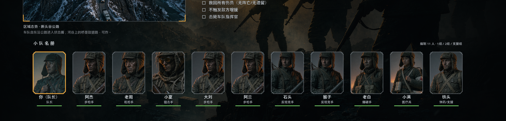 | 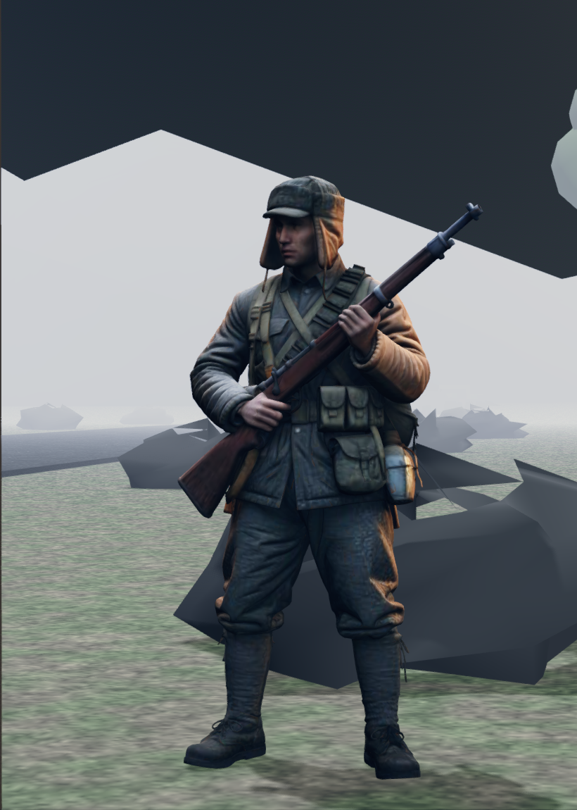 | 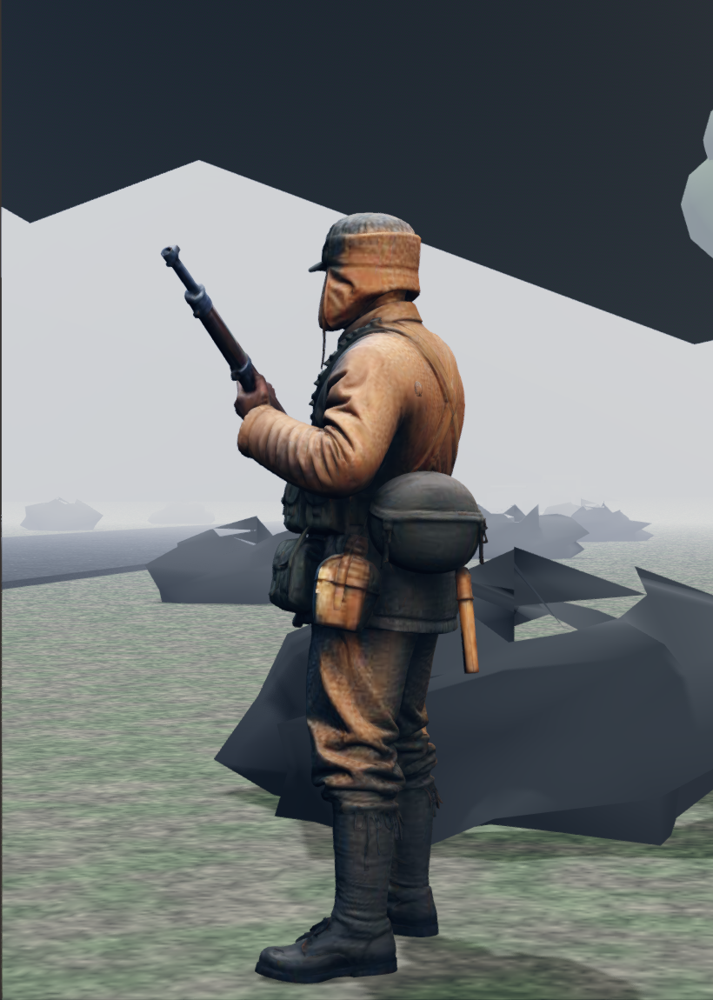 |

近景两张同时说明了三件事：模型**朝向**标定正确（正面能看到胸挂 / 水壶 / 双脚正对镜头，
侧面是干净的侧影）、**比例**为 1.68 m、**脚底**踩在地面上（靴底与草地相交，
脚下还留了一段地面）。

```bash
# 1) 立绘去水印 + 规范命名 + 自动裁 256×332 胸像
python tools/prep_char.py
python tools/montage_char.py          # 拼联络表 —— 并排才看得出切歪

# 2) 图生3D（先只做 1 个，近景确认朝向，再批量 —— 顺序错了整批返工）
python tools/gen3d_batch.py                     # 会跳过已有成品，中断后可直接续跑
#    产物 42.78MB → 瘦身到 1.56MB（网格 5 万面不动，只降内嵌 4K 贴图 → 512²）
python tools/gen3d_batch.py --force char_mg     # 指定重做某一个

# 生成通道可切换（三条路的产物规格一致，都是 5 万面 / 1.5MB）：
#   默认（不设变量）   内置通道，平台侧每天 5 次提交且当天不重置
#   VA_GEN3D_BACKEND=hy   TokenHub 直连（一把 sk- 开头的 API Key，无每日提交上限）
#   VA_GEN3D_BACKEND=tc   腾讯云 CAM 签名直连（要 SecretId/SecretKey）
# 换型号档位用 VA_GEN3D_MODEL（默认 hy-3d-3.1）：TokenHub 的免费额度是**按模型**给的，
# 3.1 用尽后同族的 3.0 还能接着做 —— 换相邻版本号是零风格风险的做法。
VA_GEN3D_BACKEND=hy VA_GEN3D_MODEL=hy-3d-3.0 python tools/gen3d_batch.py char_medic

# 额度用尽的报错是 401008（免费额度用尽且未开后付费），此时两条路二选一：
#   ① 换到同族另一个档位（上面这条，继续吃免费额度）
#   ② 在腾讯云控制台给该模型开通「后付费」—— 开通后**同一把 key、同一个模型名
#      直接就能继续**，脚本与参数一行都不用改（实测 3.1 开通后立即续做成功）。
# 另：hy-3d-express（极速版）跑得通但**不采用** —— 它只出 OBJ zip（不是 GLB，
# 还要过一遍 Blender），且贴图烘焙有明显瑕疵，与已接入的 3.1 成品风格不齐。
```

**检阅台**（`VA_UNIT_SHOW`）是模型接进去之后唯一能回答"朝向 / 比例 / 脚底落地 /
倒地姿态"的通道 —— 战场截图里单位只有几十像素高，答不了这四件事。
它与战场共用同一套建节点与姿态代码，所以看到的**就是**战场上那个模型：

```bash
# 陈列排：11 格等距两排 + 一个倒地姿态，看整体齐备度与彼此差异
VA_UNIT_SHOW=1 VA_CAPTURE=1 VA_CAPTURE_DIR=res://sweep/show \
  sdk/godot/Godot_v4.5-stable_win64_console.exe --path .

# 近景单体：正/侧/背三张对照即可钉死朝向标定
VA_UNIT_SHOW=one:char_rifleman       VA_CAPTURE=1 ...   # 正面
VA_UNIT_SHOW=one:char_rifleman:90    VA_CAPTURE=1 ...   # 侧面
VA_UNIT_SHOW=one:char_rifleman:180   VA_CAPTURE=1 ...   # 背面
```

判朝向用**身体**（胸挂 / 背囊 / 脚），不要用脸 —— 面部姿态常常是烧进网格的
（立绘里头只占很小一块，生成器会把微侧 / 低头一起烘进去）。

## 武器形象（参考图 → 三维模型 → 按键换外观）

三把 1951 年志愿军制式武器，键名在**模型文件名与代码映射表**两处是同一个
（`scene_builder.cpp` 的 `kWpnArt` / `all_wpn_keys()`）：

| 键 | 武器 | 全长 | 游戏内按键 |
|---|---|---|---|
| `wpn_mosin` | 莫辛-纳甘 M91/30（步枪） | 1.232 m | **V** 循环切换 |
| `wpn_ppsh` | 波波沙-41（冲锋枪） | 0.843 m | （同上） |
| `wpn_dp27` | DP-27 轻机枪 | 1.275 m | （同上） |

同一战局、同一种子，按 V 循环切换外观（**双手默认显示**，见下节）：

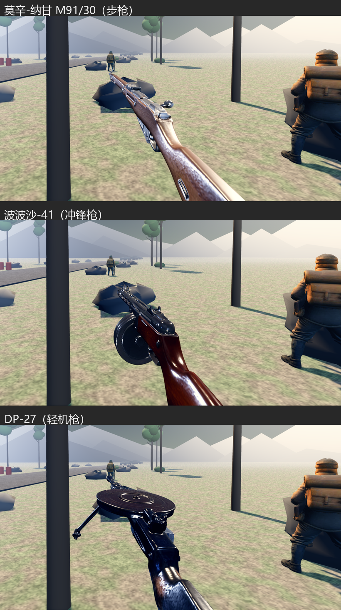

**这条线是纯表现**：三把枪共用同一个 `gun` 节点，位移 / 后坐 / 开镜那套数学一行没改，
`src/sim/` 一行没动 —— 所以"不能改判定顺序"这条约束天然成立，平衡基线也不受影响。
（也因此**没有**做"不同枪种不同切换延迟"这类事：DP-27 的 1.0 s 转枪延迟会插到
第一发子弹之前，那是数值改动。）

```bash
# 1) 取参考图并规范化
tools/fetch_wpn_refs.sh
#    产出 assets/art/wpn/wpn_*.png：1776×1776 白底**方图**（入库，作为图生3D的输入，
#    与角色立绘同一个做法）。**原始下载件与中间产物不入库**，溯源记录就是脚本里那张
#    维基文件名表 —— 参考图来自 B 站 opus 图集（《死去的回忆：使命召唤online武器设计图》），
#    画风照图、武器换成志愿军制式。
#    为什么必须方图：图生3D 那侧会把输入按中心裁剪成正方形。武器侧视图长宽比
#    3.7:1，直接喂进去**枪的首尾会被切掉**（枪管和枪托同时没），而模型建好之后
#    没有第二次机会补。

# 2) 图生3D（与角色同一套脚本，只换档位；先只做 1 把、确认朝向，再批量）
python tools/gen3d_batch.py --kind wpn wpn_mosin
python tools/gen3d_batch.py --kind wpn                 # 余下的；已有成品会跳过
#    通道 / 型号档位 / 额度规则与角色完全相同（见上一节）。

# 3) 判朝向**不需要引擎** —— 直接读 GLB 顶点做三视图 + 量枪管轴线
python tools/glb_preview.py assets/art/wpn/model/wpn_mosin.glb
```

`glb_preview.py` 一次回答三件事，都是纯离线算出来的：

1. **枪身躺在哪个轴**（实测三把都是 X，长 1.16~1.19 m，尺度就是米）；
2. **哪一端是枪口** —— 用**端面厚度**判（枪托端 0.116~0.171 m、枪口端 0.039~0.056 m），
   不用"哪头更细长"也不看准星（准星是几毫米的凸起，在顶点散布图上读不出来）；
3. **枪管轴线的竖直 / 横向偏移** —— 取最长轴**最前端 3%** 切片求均值。
   - 为什么是 3% 不是 10%：DP-27 的两脚架就装在枪口附近，10% 的切片会把两条腿
     混进均值里，算出的轴线低好几厘米 → 归位后枪管浮空、枪口焰从枪管下面喷出来。
     所以同时打印该切片的跨度，跨度明显大于一根枪管直径就说明混进了附件。
   - **横向那一项容易漏**：归一化是按**包围盒**居中的，而包围盒会被只长在一边的
     突出物带偏。实测只有莫辛偏（它的拉机柄伸在外侧 1.6 cm），波波沙的弹鼓与
     DP-27 的圆盘弹匣都在轴线上。症状是**开镜时枪管偏在画面左侧 164 px**；
     按开镜 45.5° 视场换算 1.6 cm ≈ 167 px，与实测吻合到 2% 以内。

模型是**运行期**解析的（`scene_builder.cpp` 的 `load_glb_root` 走
`GLTFDocument::append_from_file`），整条路绕开 Godot 导入器 —— 所以 `wpn/model/`
下既没有 `.import` 也没有被抽出来的贴图 jpg，加素材不必过编辑器。

### 材质：图生3D 给的 PBR 是"给离线渲染器看的"

原始参数实测是 `albedo=(1,1,1) metallic=1.0 roughness=1.0`，直接上会同时踩三个坑：
过曝（照枪的五盏灯是按程序化枪模那套深 albedo 标定到 3.8 能量的）、
高金属度缺反射探针发黑（镜面路径采不到环境）、roughness=1 把高光摊平到没有体积感。
三个旋钮各自解决一个，**默认值是量出来的**：

| 旋钮 | 默认 | 说明 |
|---|---|---|
| `VA_VM_ART_ALB` | **0.42** | albedo 乘数（乘在贴图上，所以只压暗不改贴图） |
| `VA_VM_ART_METAL` | 0.12 | metalness 强制值 |
| `VA_VM_ART_ROUGH` | 0.40 | roughness 强制值 |

albedo 那一档是扫出来的（莫辛，同一场景同一秒只改这一个系数，用差分取掩码后统计）：

| 系数 | 中位亮 | 死黑<20 | 正常 70–110 | 过曝>200 |
|---|---|---|---|---|
| 0.42 | 131 | 1.1% | **27.9%** | **15.5%** |
| 0.55 | 158 | 0.3% | 14.9% | 22.5% |
| 0.80 | 200 | 0.1% | 2.3% | 50.3% |
| 1.00 | 226 | 0.1% | 0.9% | 78.4% |

判据是"在哪一档开始崩"：0.80 起高光成片顶到白，1.00 时枪机与拉机柄糊成白块。
差分掩码天然偏向偏亮的像素，所以**绝对占比不要与 `tools/vm_eval.py` 的数字直接比**。

### 握持点：用 `glb_preview.py --probe` 从真模型上量

真模型里**没有"握把节点"这种东西** —— 握持点只能从几何剖面上读出来，
所以这个工具做的不是"看一眼"，而是**按引擎同一套归一化把顶点换算到枪的局部系**，
再按 z 切片报每一片的 y 分位数与 x 范围：

```bash
python tools/glb_preview.py assets/art/wpn/model/wpn_mosin.glb \
    --probe -0.18,-0.30,-0.45 --len 1232 --place 0.0159,-0.0655,0
```

两处自检必须**逐位对上引擎日志**，对不上就不用往下读：
`k`（归一化缩放）与"枪口 z"。实测莫辛 `k=1.035877307` / 枪口 `-1.0820`（日志
`1.0358772277832` / `-1.082`），波波沙 `0.714766594` / `-0.6930`，DP-27 `1.095202754` / `-1.1250`。

判读口径：取"低 ~ 中"那一簇 —— **最高点通常是机匣或照门，不是手该待的地方**。
另外要避开附件：波波沙的弹鼓占 `z∈[-0.30,-0.42]`（x 宽 ±0.073）、DP-27 的圆盘弹匣占
`z∈[-0.30,-0.55]`（x 宽 ±0.135），左手原来的 `z=-0.350` / `-0.400` 正好把它们
**放进附件里**，改到干净的管段 `-0.480` / `-0.620`。

**两个踩过的坑**（都会让量出来的数看着"差不多对"、其实整条参数是错的）：

1. **z 项不能减包围盒中心。** 源码只对 x/y 按包围盒居中，对 z 是"把包围盒 `+Z` 端
   顶到 `WPN_STOCK_Z`"。写成 `(p[2] − c[2]) * k` 会把整条 z 平移 `c[2]·k`
   （莫辛偏 4.9 cm）。
2. **先看 `k` 与"枪口 z"两行，别先看末尾的 z 范围。** 修好第 1 条之前，该工具打的
   z 范围是 `[-1.0332, +0.1988]`，与正确的 `[-1.0820, +0.1500]` **恰好差一个常数
   0.0488**（就是被多减掉的那一项）。当时把那条**旧输出**误读成"修正后仍然不对"，
   白绕了一圈。`k` 与枪口 z 这两个自检位是逐位可对日志的，先看它们。

### 双手：接真模型之后"手"是怎么丢的、又是怎么找回来的

玩家报的症状是**"视角下只有一支枪，没有手来持枪"**。根因有四层，四层都会独立
造成同一个症状 —— 所以只修对其中一层，画面上看不出来：

1. **开关反了**（最直接的一层）：`VA_VM_HANDS` 原先写成
   `std::getenv("VA_VM_HANDS") != nullptr` → **不设就藏**。等于默认从不显示双手。
   改成"只有显式写 `=0` 才藏"（`hands_enabled()`）。
2. **握持点只量了 z**：`load_skin()` 对真模型只沿 z 平移手，x/y 沿用程序化枪模那套
   → 手整块陷进枪身里。握持点改成**三维**（`WpnNodeInfo::hand_r_pos/hand_l_pos`），
   由 `tools/glb_preview.py --probe` 按真模型的剖面逐把量出来（见上一节）。
3. **前臂起点落在掌心**：前臂是直径 4.8~6.4 cm 的圆柱，手掌只有 5.4×8 cm ——
   起点放掌心 = **手掌整只被管子包住**。改成从掌背起笔。
   顺带：手要放在相机的**近侧**（`x` 取负），放在远侧会被枪身完全挡住。
4. **材质几乎全黑**（本轮才量出来的第四层，也是最"看不见"的一层）：
   位置对了、默认显示了，手照样读不出来。实测（`tools/vm_hand_probe.py`，莫辛）：

   | 部件 | 改前 | 改后 |
   |---|---|---|
   | 枪身 | L143 / 过曝 25.2% | **L143 / 过曝 25.2%（逐位相同）** |
   | 手套 | L52 `RGB(43,52,74)` 偏蓝灰 | **L96 `RGB(119,90,83)` 皮革棕** |
   | 袖子 | L33 `RGB(24,34,45)` 近黑 | **L88 `RGB(111,84,53)` 军装卡其** |

   根因不是位置而是**标定失配**：0.160/0.170 这两个 albedo 是配**程序化枪身**
   （0.165 深灰）标出来的，两者同档、看着是一体。换成真模型之后枪身变成暖木+冷钢
   的 L143，双手停在 L33~L52 —— **比枪暗 2.7~4.3 倍**，再叠上偏蓝的色偏，读出来
   就是"一把枪 + 两根横插进来的树干"。

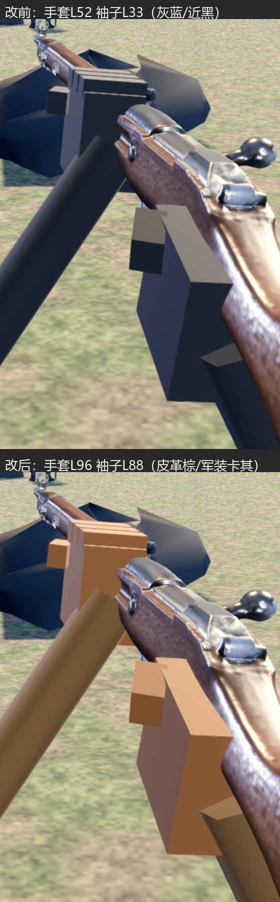

**色偏的归因做过一次实验，排掉了一个想当然的答案**：把 `VA_AMBIENT` 从 1.62
归零，手套只从 L52 掉到 L49（−5%）、袖子 L33→L30（−9%）→ **不是环境光**，是五盏
枪模灯里那两盏偏蓝的（冷补光 `0.68/0.77/0.95`、轮廓光 `0.55/0.60/0.68`）正打在
"朝相机"的那些面上，而唯一照朝相机面的中性光（第 3 盏轴光）只有 1.5 能量。

**试过并且否掉的一条路：把轴光提上去。** 直觉是"轴光 travel 近乎纯 −Z，只对法线
朝 +Z 的面有效，而枪身上这种面很少"。实测把这个直觉否掉了（轴光 1.5 → 3.2）：
手确实亮了、色偏也修好了，但**枪身跟着变** —— 中位 `RGB(136,143,168) → RGB(182,141,115)`、
过曝 25.2% → 26.5%。原因是**圆柱体的可见半边本来就朝相机**，枪管/机匣/弹匣全吃
这盏灯。枪身的亮度是逐档标定出来的（见上面 `VA_VM_ART_ALB` 那一段），不能让双手
把它带跑 —— 所以灯一律不动，补偿全部做在手套/袖子**自己的 albedo** 上，
改它们对枪的影响恒为 0（11 次扫描里枪身始终在 L143、过曝 25.1~25.3%）。

⚠️ **这个 albedo 不能按通道线性反推，会被 ACES 的跨通道混合打脸。** 实测把蓝
albedo 从 0.187 降到 0.090（只动这一项），渲染出来的**红反而从 119 升到 174（+46%）**、
绿几乎不动（71→66）。所以色相/亮度只能经验扫（扫的过程与全部中间值记在
`viewmodel.cpp` 的材质注释里）。

已知的观感局限（没做，留给下一轮）：前臂是**等径直圆柱**、没有肘部与肩部。

### 持枪画面：从"木板 + 方块"到"手背 + 扣过护木的四指"

玩家给了三张参考图（CSGO / BFV / 一张近景），要"美化持枪画面"。三张图的共同
语言是：**看得到的主体是"手背那一坨 + 绕过去的四指"，前臂只从画面下缘露出
短短一截暗色剪影**。上一版两条都反了 —— 手是方块、前臂是一根亮色的等宽长杠，
于是画面上最抢眼的是"一根亮柱子"而不是枪。

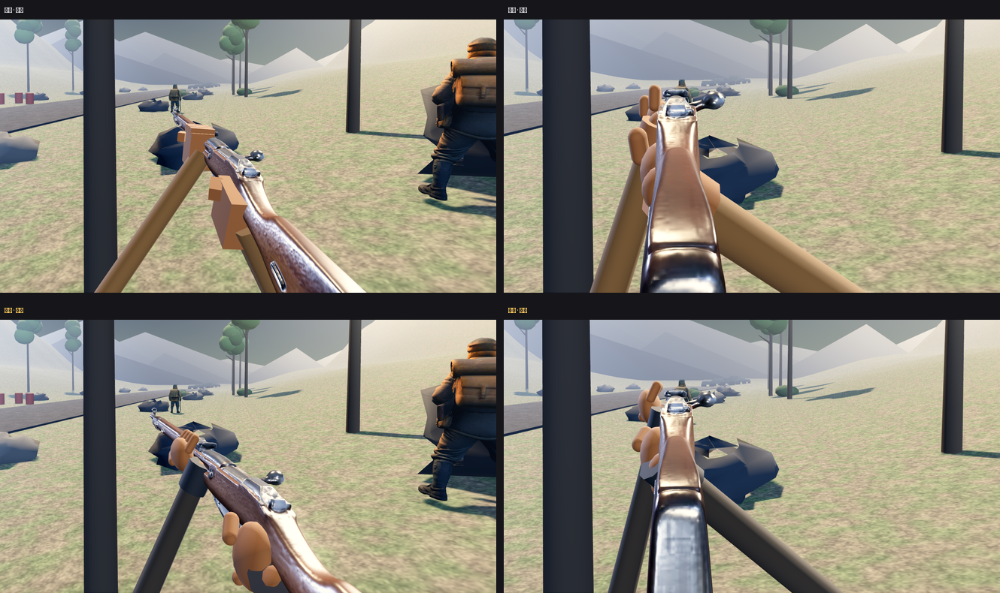
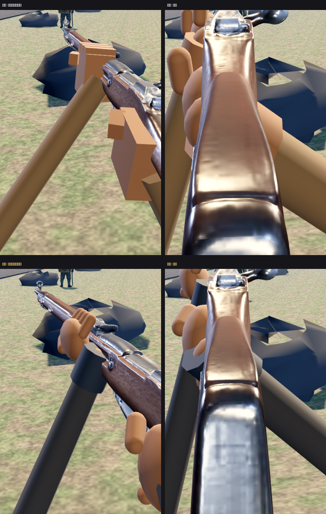

#### 一、肘的位置**救不了**这幅画面（先量后改，省了一轮）

直觉是"把肘往外甩、前臂就斜出去了"。实测把这个直觉否掉：两只肘从
`(0.30,-0.44,-0.12)` 一路挪到 `(0.56,-0.60,-0.43)`，腰射截图逐像素比对
（阈值 8）**只有 1% 的像素有差异**。原因是肘本来就在画面外，露出来的那一截
（腕 → 画面下沿）的屏幕位置**只由腕端决定**：腕 `u0.538 v0.691`、肘 `u0.409 v1.230`。
腕不动，露出来的 423 px 一分不少；而按真人前臂 0.27 m 的长度反推，肘能提供的
横向漂移最多 130~190 px。**结论：这 423 px 只能靠"明度结构"消化，靠挪肘没用。**

#### 二、真正起作用的三笔

| 改动 | 改前 | 改后 | 为什么 |
|---|---|---|---|
| 袖子 albedo | 0.500（渲染 **L88**） | **0.330**（渲染 L~44） | 那条前臂在腰射画面里是 423×150 px，占屏面积比枪管还大。L88 是画面下半部**最亮的大块**，眼睛先看到"亮柱子"再看枪。参考图里那条前臂一律是**暗色剪影** |
| 腕带 | 手套色，**看不见** | 深色皮革 0.150 + 半径 ×1.32 | 手 → 腕带 → 袖子 = `L96 → L30 → L44` 的明度阶梯，前臂与手之间第一次有"关节" |
| 袖褶 | 无 | 手臂 62% 处套一圈 ×1.13 的短管 | 一根从腕延伸到画面外的等宽圆柱读出来是"木头"；加一道褶才是"布" |

⚠️ **一个只有换过材质才暴露的坑**：腕带第一版放在腕端往肘 2.2 cm 处，结果
手套色的**小腕球**（albedo 0.54）孤零零留在手腕上，渲染成画面下方最亮的一块
（读成"金属护腕"）；而深色腕带紧贴在它下面、压在同样深的袖子上，**等于不存在**。
判据：识别色图里腕球与腕带都是"手套绿"，**分不出来** —— 只能靠"正常图手腕处
是不是比手还亮"来判断，别指望染色图。

#### 三、手：从"方块 / 香肠"到"手背 + 四指"

- **左手**：上一版是一块埋在木头里的掌 + 四根**竖直**胶囊。竖直胶囊在画面上就是
  四根并排立着的柱子，读成"香肠浮在枪旁边"。重做：掌外移成**手背**（木头左外侧
  露出 ~3 cm 宽一整片）、四指**绕 Z 倒 34°**斜搭在木头左上棱上、指尖越过顶面
  1.7 cm。拇指改成**顺着护木往前指**，但它必须**压在手背上** —— 放到手背轮廓
  之外时，它在染色图里是一个和手完全分开的椭圆（中间隔着世界色）。
- **右手**：四指原先也是竖的，且最上面那根比掌顶还高 6 mm，画面里是**单独一块
  漂在手背上方**。改成绕 Z 倒 70°（几乎水平）沿 y 叠四道 = 四道**指背**，
  并把掌半高抬到 0.042 让整列收进轮廓里，指尖从远侧探出去一点。
- **几何基元**：手一律用 `SphereMesh` 椭球 + `CapsuleMesh` 胶囊。方块在这个距离
  （0.24~0.42 m）三条棱各受不同方向的灯，读出来就是"一摞棕色积木"；椭圆/胶囊的
  平滑法线让明暗连续过渡 —— 同样的轮廓立刻变成"一块肉"。

#### 四、开镜：托底板原本糊掉下半屏

`VA_VM_AIMDIST` 从 0.200 提到 **0.270**。这不是手感问题，是画面占比：
0.200 时托底板落在眼前 20 cm，它 8.4 cm 高 → `0.084/(2·0.20·0.6371)·1369 ≈ 820 px`，
**开镜画面下半屏整个被托底糊住**。扫 0.20 / 0.27 / 0.34 三档取证，0.27 是
"托底退到画面下缘之外、枪身仍占满中央"的那一档（0.34 时枪身细成一条）。
改它**不影响开镜对准** —— 落点由照门反推，拉开距离只是等比缩小。

已知仍不理想的一处：开镜时支撑手那四根指头**沿枪轴排开**，看过去正好叠在一起，
读成"一撮指头"。要修得让它们在这一个视角下也散开，得改成绕枪管一圈的弧，
留给下一轮。

### 双手真模型：从"椭球 + 胶囊"换成图生3D 的真手（含一次镜像实验和一套开镜姿态）

上一节把手的**明度与轮廓**修到了"读得出是一只手"，但几何终究是"椭球掌 + 四条胶囊指"。
这一轮用混元生3D（`tools/gen3d_batch.py --kind vm`）把它换成真模型。
键名 `assets/art/vm/model/vm_hand_r.glb`，**只生成了右手一份**，左手镜像复用。

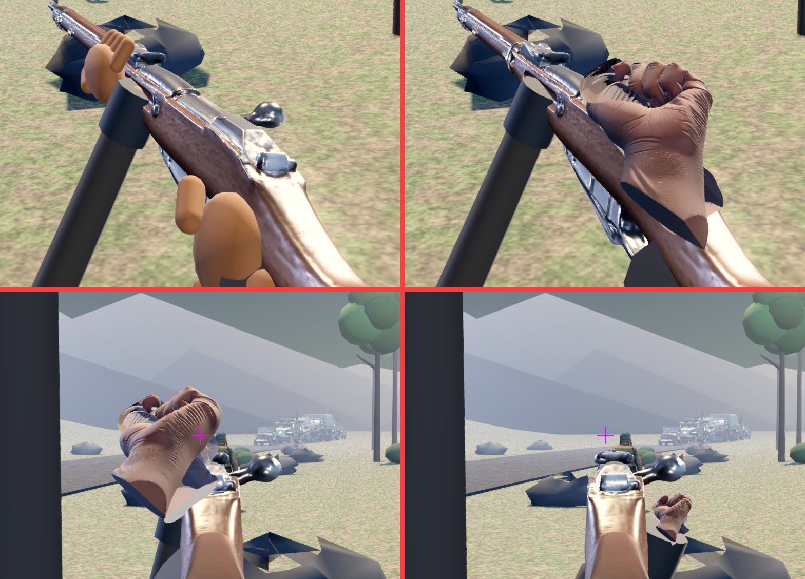

#### 朝向：对轴自动算，残余角**解**出来

原始包围盒 `(0.723, 0.916, 0.416)` → **长轴在 Y**（不是 X）。三视图判读给出
"腕在 −Y、指节在 +Y、手背朝 +Z、拇指在 −X"。**对轴（最长维 → −Z）是算出来的**，
理由见「载具形象」那节的铁律：图生3D 的长轴躺在哪个轴逐张不同，假定错了不报错、只静默转坏。

但**"读起来自然"不等于"拿在手里自然"**：对轴只保证长轴躺平，滚转/翻面它一概不管，
首版残余角给 0，渲染出来是"**一大块肉**"（腕口切面正对相机）。所以残余角不是扫出来的，
是**解出来的** —— 要求"腕端(模型 −Y)指向肘、手背(模型 +Z)指向相机"，联立解得
`4.1°,20.2°,48.5°`（回代误差 2.2e-16）。另一组解 `(−31.0,−20.7,39.6)` 会让腕口
切面正对相机（画面里出现一个大圆盘），已否掉。

#### 尺寸：模型的长轴里含一截腕柱

这个模型是"**握拳 + 一截手腕**"（参考图自带 ~40% 前臂）。所以**不能**按"腕→中指尖
18.5 cm"归一化 —— 那等于整体放大 1.6 倍。扫 0.185 / 0.145 / 0.135 / **0.115** / 0.095，
0.115 最好，而它恰好接近"腕横纹→指节"的真人口径（~0.10 m），也就是这条长轴的真实语义。

#### 材质：`set_roughness()` 是**乘数不是赋值**

接进来第一版渲染成"**抛光皮手套 / 乳胶**"。看着像"roughness 标量太小"，但**调标量
永远调不好**（0.88 → 1.0 几乎无变化）。根因：图生3D 自带 roughness/metallic 贴图，
Godot 的最终值 = **标量 × 贴图**，而那张贴图大量区域接近 0。
修法：把这个模型上的 `TEXTURE_ROUGHNESS` / `TEXTURE_METALLIC` **清掉**
（`VmMatCfg::clear_pbr_maps`）。⚠️ **枪那边不打开这个开关** —— 它的三个标定参数是
"带贴图"扫出来的，一改口径整套标定作废。

另外手**只乘色调、不压成灰**：贴图带着指节褶皱/掌纹/指缝阴影，那是"这是一只手"的
全部信息来源。`VA_VM_HAND_TINT`（sRGB `0.50,0.42,0.36`）与枪的 `VA_VM_ART_ALB`
（线性标量乘数）**单位不同、不能混用**。

#### 镜像：做过 A/B，结论是**无害**（省下一张生成额度）

左手直接用右手的 glb + 负缩放镜像（负行列式翻转绕序，所以手模材质一律
`CULL_DISABLED`）。曾怀疑"左手偏暗 = 负缩放把法线翻了"，做 `VA_VM_HAND_NOMIRROR=1`
的对照，用**各自的识别色掩码**去常规图上取亮度：

| | 手套（远/支撑） | 手套（近/扳机） | 袖子 |
|---|---|---|---|
| 镜像 | n=12898 中位 L=36 | n=73319 L=80 | n=31213 L=42 |
| 不镜像 | n=15210 中位 L=40 | n=74950 L=81 | n=31201 L=42 |

两边几乎逐位相同 → **负缩放没有改坏着色，镜像可以留**。
（那次"左手是橄榄色"的判断其实读到了**上一轮遗留的旧裁剪图** —— 教训：A/B 图必须
现场重裁，别复用一个目录里的旧 png。）

#### 代价与收益（同掩码口径 `|常规 − 藏VM| ≥ 12`，莫辛腰射）

| | 枪身 | 手套 | 袖子 | VM 合计 |
|---|---|---|---|---|
| 程序化手 | 114970 (3.28%) L=155 | 55854 (1.59%) L=92 | 31158 (0.89%) L=42 | **5.76%** |
| 真手模 | 86379 (2.46%) L=133 | 86107 (2.46%) L=76 | 31213 (0.89%) L=42 | **5.81%** |

**总占屏几乎不变**（5.76% → 5.81%）—— 真手是"盖住了一部分枪身"（枪身 −0.82%），
不是额外糊上去一块；袖子逐位相同，说明前臂那条链没被带动。

#### ⚠️ 开镜时两只手**都**压住照门 → 给视图模型加了一套"开镜姿态"

开镜时枪轴与视轴重合，握把上的扳机手与护木上的支撑手**都**落在瞄准轴附近。
实测"最近的手像素到画面中心（= 照门 = 瞄准点）"：

| | 最近距中心 | 中心 80 px 内的手像素 |
|---|---|---|
| 程序化手（改动前） | 39 px | 3296 |
| 真手模，不让位 | **0 px** | **13005** |

所以这**不是"接真模型必然的代价"，是新引入的退化**。

**落位不是解**：扫过 5 档（含下移 40 mm、后移 60 mm），最近距中心**始终是 0**；
再把任一只手移出画面做消融，**另一只手仍然压住中心**。所以照真 FPS 的通行做法，
给视图模型**分腰射/开镜两套姿态**：随 `ads` 把双手缩 0.65、往 `(0.06,−0.04,0.02)` 让位。

- 缩放只作用在 `hand_r` / `hand_l` **自己**身上（即绕握持点缩），**不缩 `hands`** ——
  缩 `hands` 会把前臂一起缩细。
- 位移**同时给手掌与腕端**（`place_arms()` 里一处），只让手不让腕会在正对相机处
  裂开一个断口。
- 腰射时 `ads = 0` → 缩放 1、位移 0，是**构造保证**的恒等变换。
- **定档只能按最挤的那把枪**：缩 0.50 时莫辛 98 px 已 OK，但**波波沙 65 px 仍压住**
  （中心 80 px 内还有 284 px 是手）。缩 0.65 后三把全清：莫辛 125 / 波波沙 87 /
  DP-27 125，中心 80 px 内**一律 0**。原因是让位量是三把枪共用的一个常量，而三把枪的
  照门高度差了一倍多（莫辛 0.075 / DP-27 0.160）。

#### 取证：截图**不可逐位复现**，A/B 必须跟噪声比

同一套取证里，"同参数重拍两次"的腰射截图差 >8 的像素有 **19421 (0.554%)**、
差 >0 的有 **4.033%**（仿真跟墙钟走，姿态/动画在截图那一帧并不完全一致）。
而"零旋钮改动 vs 基准"只差 4204 (0.120%) —— **小于噪声**，这才证明改动是恒等变换。
**任何 A/B 结论都要跟这个噪声底比，不能要求逐位相同。**

配套的另一个坑：**分辨率会偶然漂**。同一套取证里出现过一张 1920×1080、其余都是
2560×1369（重拍三次都正常）。拿 1920 的坐标去裁 2560 的图，比的根本不是同一块区域 ——
差一点据此得出"开镜时手的位置完全不同"的错误结论。**判读前先打印尺寸。**

### 开火时的枪口焰：判定必须排在扣减之前

症状是**"开火时没有光效"**。根因是一行顺序：

```cpp
flash_t -= dt;                    // ← 先扣
if (flash_t > 0.0f) { …画… }      // ← 后判
```

闪光时长 0.045 秒。**只要一帧的间隔 ≥ 0.045 秒，这一次扣减就把整段闪光扣成负数**、
判定为假，于是**一帧都画不出来**。0.045 秒对应的门槛是 **22 fps**，而本机实测帧间隔
**0.092~0.100 秒（≈10 fps）**，是门槛的 2 倍以上 —— 这是一个**只在低帧率机器上成立**
的 bug，高帧率机器上根本复现不出来。

修法是把顺序倒过来，并且亮度取**扣减之前**的剩余比例（保证第一帧必定满亮），
结束时再显式 `set_visible(false)` + 点光归零：

```cpp
if (flash_t > 0.0f) {
    const float k = clampf(flash_t / flash_sec(), 0.0f, 1.0f);   // 先取比例
    flash_t -= dt;                                               // 再扣时间
    …
}
```

这样**任意帧率下都至少曝光一帧**，与帧率解耦。判据落在日志上（`VA_DBG_VM=1`）：

```
[vm] dt 0.1067s ≈ 9 fps   （枪口焰时长 0.045s，要 dt 小于它才画得出来）
[vm] dt 0.0926s ≈ 10 fps
[vm] 枪口焰 结束：亮 1 帧  最大帧间隔 0.092s（≈10 fps）
```

实测 3 次开火、每次**亮 1 帧**、"亮 0 帧"出现 **0 次**；同一份日志里战斗确实打起来了
（`t=226.61 命中 +3 / 击杀 1`）。判读口径：`dt > 0.045` 说明**旧代码在这个帧率下必然
是 0 帧**（0.045 − 0.092 < 0），`亮 N ≥ 1` 说明修复生效。

**"枪口焰长什么样"本来是一张注定拍不到的图**：0.045 秒比本工程三种取证手段的最小
粒度都短（事件落盘要等 0.05 秒墙钟、定时截图按战局秒数触发）。所以另给一个
`VA_VM_FLASH=<秒>` 把它**按住**再拍 —— 而且必须跑到真打起来（车队 175 秒才入场、
伏击要等先头车 `x < 1180`），否则一条 `[vm] 开火` 都不会有：

```bash
VA_VM_FLASH=30 VA_AUTO=1 VA_SCRIPT_A=1 VA_FF=15 VA_CAPTURE=245 \
  tools/capture_wpn.sh wpn_mosin "" sweep/v_flash_shot
```

（`capture_wpn.sh` 现在允许调用方覆盖 `VA_CAPTURE`，就是为了这条用例 —— 默认那 1 秒
那一帧离交火还差 240 秒。）

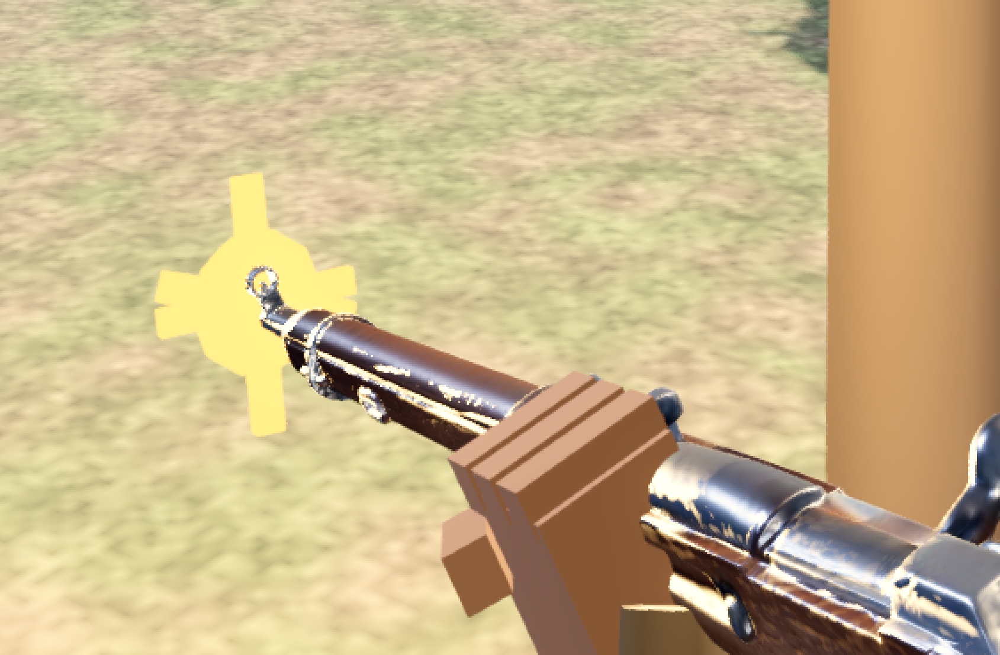

枪口焰由 4 块 `vm_glow`（不受光 + 自发光）几何组成：一颗小球 + 3 根交叉的方条
（±36°/−52°/18°），再配一盏 `OmniLight3D`（range 9 m、`cull_mask` 全开）——
所以开火时**周围的草地与枪身也会亮一下**，反馈比只有一团黄色几何强得多。

### 开镜时准星该不该让位

程序化枪模在开镜时靠枪上那颗**红点**当瞄准参照，HUD 准星是**刻意**让位的
（否则屏幕中央会出现两个准心）。但真模型没有那颗红点，于是
"(开镜) + (真模型)"这个组合下会**一个瞄准参照都不剩**。
所以 `Hud::draw_crosshair` 多加一个条件：枪上还有瞄具才让位。
判断依据由 `world_sim` 把 `ViewModel` 的指针交给 HUD（收指针而不是收布尔量，
就不必在"按 V 换枪"那条路上再同步一次）。

⚠️ **真模型的机瞄没有登记到屏幕中心**——那是要逐把枪标定准星高度才做得到的另一件事，
本轮没做（属于"观感"而不是"打不准"：弹道与判定完全没有变）。

**这条规则必须用日志验，不能看图。** 准星（中心圆点 + 四条**正交**短线）与命中标记
（四条 **±45° 斜线**）在截图里几乎一样；而跨运行截图差分会被"仿真跟墙钟走"的时序差异
整片淹掉（实测全屏差异 17%，信噪比为零）。用 `VA_DBG_HUD=1` 跑三态矩阵：

```bash
VA_DBG_HUD=1 tools/capture_wpn.sh -  --ads --hud   # 程序化 + 开镜
VA_DBG_HUD=1 tools/capture_wpn.sh wpn_mosin --ads --hud   # 真模型 + 开镜
VA_DBG_HUD=1 tools/capture_wpn.sh wpn_mosin --hud         # 真模型 + 腰射
grep '\[hud\]' sweep/*/run.log
```

期望（实测）：

| 外观 | 开镜 | `枪上有瞄具` | `真模型` | → | 近白像素 | 横带 `\|y\|<18` | 竖带 `\|x\|<18` |
|---|---|---|---|---|---|---|---|
| 程序化 | 1 | 1 | 0 | **让位** | 89 | **0** | 11（y −41..−28） |
| 莫辛 | 1 | 0 | 1 | **保留** | 332 | 96（x −29..30） | 127（y −41..30） |
| 莫辛 | 0 | 0 | 1 | **保留** | 264 | 有 | 有 |

让位那张的 89 个近白像素全落在**左上**（x∈[−90,+1]、y∈[−41,−23]），横带里**一个都没有**
→ 那是路面/草地的浅色边，不是准星。保留那两张的横竖两条臂都在，且跨度与代码对得上
（`gap = (5 + sp·26 + bloom·16)·s_`、`len = 10·s_`，1080p 下 `s_=1` → 臂的外端 ≈ 31~41 px）。

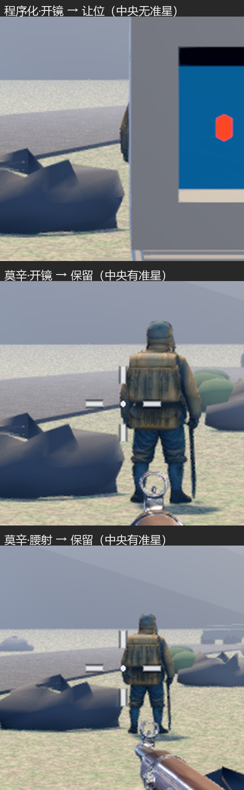

（中裁 200×200 放大到 560 宽，ROI 对准日志报的中心。判据取**质心**：
准星关于中心对称 → 质心 ≈ (0,0)；背景里的白色斑块不对称。
近白判据是 `min(r,g,b) > 200 且 max−min < 26`，对准星本体色 `Color(0.94,0.96,0.98)`；
换算要带上 `stretch/aspect="expand"` 的缩放 —— 基准 1920×1080 在 2560×1369 窗口下
画布是 2018×1080，即 ×1.2676。）

**两个踩过的坑**（都由这条日志一次抓出来，看图两条都发现不了）：

1. `ViewModel::using_art()` 原先写的是 `art_holder != nullptr`，而 `art_holder` 是
   `build()` 里**无条件**建的挂载点 → 恒为 true → 连程序化枪模开镜也跟着让位，
   把原本"让位"的行为**改坏了**。真正该问的是"这个槽位的模型节点建出来了吗"
   （`art_nodes[art_index] != nullptr`）：只有 `load_skin` 会建它，`VA_VM_NO_ART`
   走的分支根本不调 `load_skin`。
2. `VA_ADS` 原先只喂 `ViewModel::update` 的 `ads` 形参，`va::IN.ads` 一直是 false；
   而 `draw_crosshair` 读的正是 `va::IN.ads` → 强制开镜的取证图里两者不同步。
   现在 WorldSim 把同一标志也交给 HUD。

顺带一条与判据无关但会误导人的坑：`VA_DBG_HUD` 的"变化检测"原先只盯结论，
于是第一帧那次打印会带着**启动时的小视口**坐标一直留在日志里
（实测窗口随后变成 2560×1369，日志却一直写 `中心=1010,540`）。现在视口尺寸变了也重打。

### 取证：按外观拍图

```bash
tools/capture_wpn.sh wpn_ppsh              # 腰射；定住 种子/外观/藏HUD/落盘目录 四件事
tools/capture_wpn.sh wpn_dp27 --ads        # 开镜
tools/capture_wpn.sh wpn_dp27 --ads --hud  # 开镜且保留 HUD（验准星规则要看这个）
tools/capture_wpn.sh - --ads               # 程序化枪模（消融对照）
VA_VM_ART_ALB=0.8 tools/capture_wpn.sh wpn_mosin   # 顺带扫材质旋钮（环境变量是继承的）

# VA_CAPTURE 可以被调用方覆盖（默认 1 秒那一帧）—— 要看"打到交火之后"的画面
# 就得把时刻往后推，那时还要配 VA_AUTO / VA_SCRIPT_A / VA_FF，见"枪口焰"那节
VA_CAPTURE=30 tools/capture_wpn.sh wpn_mosin

# 拼成一张对照表 —— 并排才看得出"哪把偏黑 / 金属是不是糊成白块"
"C:/Program Files/Python311/python.exe" tools/montage_wpn.py sweep/cmp.png \
    sweep/v_wpn_mosin sweep/v_wpn_ppsh sweep/v_wpn_dp27
```

⚠️ 拼图工具的 ROI 是**按整帧坐标**取的，喂**已经裁过的小图**时必须显式写
`--roi 0,0,<宽>,<高>`；否则它会按默认 ROI 去切一张尺寸不够的图，输出一张
几万像素高的废图（踩过）。

按键切换同样要**真事件流**取证（脚本会把"按键流 + 日志 + 画面"三份证据对起来）：

```bash
# 起游戏后按 V，日志里应出现连续的 "武器外观 N/3 <名字>"，第 3 次回绕到第 1 把
"C:/Program Files/Python311/python.exe" tools/inject_key.py --key V --focus VolunteerArmyPC
```

## 载具形象（参考图 → 三维模型 → 替换程序化图元）

车队的四辆车原先是一层**程序化图元**（车体盒子 + 炮塔 + 炮管 + 车厢 + 机枪座 +
四个轮子），现在换成图生3D 的真模型。键名与 `va_config.cpp` 里 `vehicle_of()`
认的四个键、以及 `make_vehicle_node` 的 `type` 字符串**三处同名同数**：

| 键 | 型号 | 引擎里的车体尺寸（`spec.len/wid`） | 渲染后实测（长 × 高 × 宽） |
|---|---|---|---|
| `jeep`  | Willys MB | 3.35 × 1.57 m | 3.35 × 1.66 × 1.56 m |
| `apc`   | M3 Half-track | 6.20 × 2.22 m | 6.20 × 3.19 × 2.32 m（高含枪架） |
| `tank`  | M4A3E8 Sherman | 5.85 × 3.00 m | 5.85 × 2.87 × 2.84 m |
| `truck` | GMC CCKW | 6.95 × 2.25 m | 6.95 × 3.04 × 2.62 m |

> **2026-09-20 起 `spec.len/wid` 就是实车尺寸**（此前是一套"还没有模型时的占位碰撞盒"，
> 只做到实车的 47%~63%）。所以这张表的第三、第四列应当彼此接近 ——
> 差得多就说明归一化或模型比例出了问题。

1951 年铁原阻击战设定，敌方身份由角色立绘钉死（`char_enemy_rifle`：M1 钢盔 +
M1 加兰德 + M1943 野战夹克 = **美军**），所以四辆取朝鲜战争美军制式。

四辆车的正面与侧面（每格右侧站着的是 **1.68 m 的步枪手，当比例尺**；
正/侧两图同为偏航 0° 与 90°，用来同时钉死**朝向**与**比例**）：

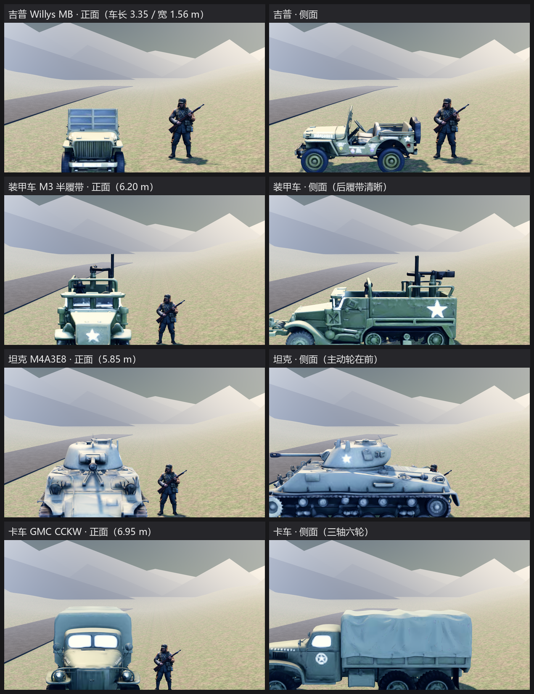

`veh:row` 陈列排 —— 四辆车**同时**同框，一眼看出顺序与彼此大小关系
（全部车头正对镜头 = 全部朝局部 +X，这一排就是朝向标定的总检）：

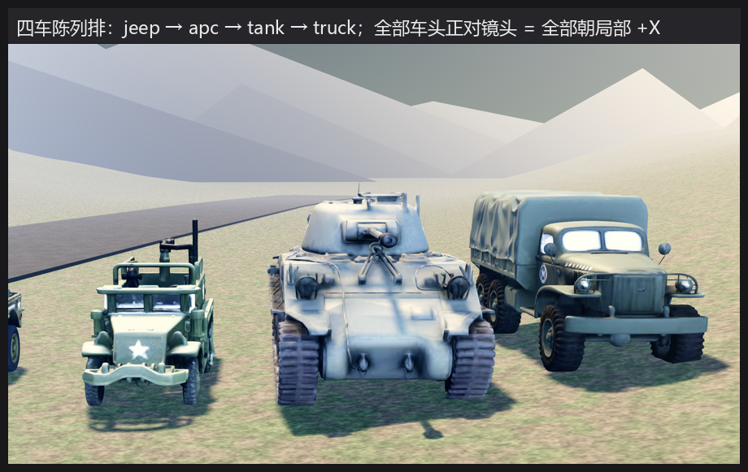

### ⚠️ 车长改实车尺寸，牵动的不止"看起来多大"

**改法本身只有一行数据** —— 因为渲染尺寸的唯一来源就是 `spec.len`
（表现层按 `target_len = spec.len × S` 等比归一化模型），改数据表，
`src/node/` 一行都不用动：

```bash
# 改前：吉普 2.3 m（实车 3.33）—— 站在 1.68 m 的兵旁边像辆高尔夫球车
# 改后：吉普 3.35 m（实车 3.33）—— 风挡顶到士兵头部
```

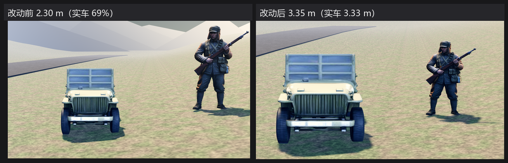

但 `len/wid` 在 sim 里身兼数职，改它会连带动到一串**按旧车长调过**的常量。
这一轮把它们全部改成从尺寸推导 —— 留一个写死的，就是下一个"一个数干两件事"的静默 bug：

| 位置 | 原先 | 放大后会怎样（都不报错） | 现在 |
|---|---|---|---|
| `va_world.cpp` 生成间距 | 写死 `132` | 6.93 m 的卡车比 6.6 m 间距还长 → **与邻车穿模** | 统一走 `CFG.convoyGap` |
| `va_ai_enemy.cpp` 增援卡车 | 写死 `140`，且 `v.len = 66` 抄了一份 | 增援车静默留在旧尺寸，比车队里的卡车小一圈 | `CFG.convoyGap` + `tsp->len/wid` |
| `va_units.cpp` 残骸跟停 | `<= 52`（中心距 2.6 m） | 半长之和 6.6 m → **后车叠进前车 4 米** | `(v->len + wreck->len)/2 + 8` |
| `va_ai_enemy.cpp` 下车偏移 | `rr(16,42)`（0.8~2.1 m） | 半宽 1.1 m → 士兵**下到车厢里** | 从 `wid/2` 起算 |
| `va_combat.cpp` 机枪口 | `* 30`（1.5 m） | 半长 3.5 m → 弹丸与枪口焰出现在**车厢内部** | `len/2 + 10` |
| `va_level.cpp` 殉爆半径 | `len * 0.9` | 半径悄悄放大 1.5~2.1 倍 | 显式 `spec.blast_r` |

**为什么殉爆半径必须单独拆出来**：它是唯一一个"看起来像尺寸、其实是玩法"的量。
`len * 0.9` 让"车多大"直接决定"打爆它伤多大范围" —— 于是改美术尺寸就会悄悄改难度，
而 `explosion()` 对 `kind == "vehicle"` **连友军一起打**（`va_level.cpp` 里的队伍判定），
伏击又是贴脸打，所以这一项实测值 1 胜。现在它是 `VehicleSpec.blast_r`
（`0` = 回退到 `len × 0.9`），四辆取改动前的绝对值 41 / 54 / 67 / 59。

### ⚠️ 代价：实车尺寸让伏击变难（10 种子 8/10 → 6/10）

车变大之后，车队从"6 个 3 米小盒"变成"一道 35 米、会吸子弹的墙"。
用 `va_sweep` 做归因（每次只动一处）：

| 改动 | 胜率 | 说明 |
|---|---|---|
| 改动前（小车，方案 A） | **8/10** | 已采用的基线 |
| 实车尺寸（全效） | 5/10 | 车体挡子弹 + 挡路 + 殉爆半径跟着涨 |
| 只把殉爆半径钉回原值 | 6/10 | 殉爆是可拆的那 1 胜 ✓ 已采用 |
| 只关掉载具寻路遮挡 | 6/10 | 不采用（士兵会穿车而过） |
| 车顶机枪 0.40× / 射速 0.40× / 队友耐久 ×1.4 | 7/10 | 旋钮**填不平**这个结构性变化 |

剩下那 2 胜是**物理必然**：一辆 6.95 m 的卡车确实会挡下更多子弹、占更多路面。
所以目前**保留方案 A 的旋钮不动**，把这条差异摆在明面上，
而不是靠调旋钮把它藏起来（旋钮是给"手感"用的，不是给"把车画大"擦屁股的）。

```bash
# 1) 取参考图 + 统一车头朝右 + 抠底补方 → assets/art/veh/veh_*.png（1600 长边、1776² 方图）
python tools/fetch_refs_bing.py --jobs      # 出候选 + 带编号的对照表
tools/prep_veh_refs.sh                      # 挑好的候选 → 规范化的图生3D 输入
#    为什么必须方图：生成侧会把输入按中心裁成正方形，车辆侧视图 1.5:1~2:1，
#    不补方会被切掉车头或车尾 —— 而模型照样生成成功、文件非空。
#    为什么统一朝右：位置层 +X 就是车头，四张同向才能共用一个校正角（见下）。

# 2) 图生3D（先只做 1 辆、确认朝向，再批量；已有成品会跳过）
echo -n "<token>" | python tools/gen3d_batch.py --kind veh --jobs 2 veh_jeep
echo -n "<token>" | python tools/gen3d_batch.py --kind veh --jobs 2 veh_apc veh_tank veh_truck
#    通道 / 额度规则与角色、武器完全相同（见"角色形象"那节）。

# 3) 接进引擎后拍近景钉朝向 / 比例 / 落地
tools/capture_veh.sh jeep          # 临时偏航 0°：应当看到**车头正面**
tools/capture_veh.sh jeep 90       # 转 90°：看侧面（负重轮、车厢）
tools/capture_veh.sh row           # 四辆车的陈列排
```

### 朝向校正分两段：**几何自动对齐 + 逐辆实测的残余角**

引擎里载具节点的局部 **+X 就是车头**，两处独立依据：`make_vehicle_node` 用
`Vector3(L, hull_h, W)` 建车体（长度沿 X）、坦克炮管摆在 `x=0.95`；
且 `vehicle_blocked` 把世界坐标按 `lx = dx·cos(-angle) - dy·sin(-angle)`
转进车体，`angle=π`（车队自东向西）时 +lx 指向西 —— 与局部 +X 同向。

而图生3D 把"图像的哪个方向"映到"模型的哪个轴"是**服务端定的、只能实测**，
**而且逐张不同**。所以朝向被拆成两段，一段都不许省：

**① `align` —— 把最长的水平轴转到 X（几何决定，无猜测）**

判据是水平两轴的实测长度：四辆车的实物长宽比都在 2:1 以上，
所以"车长在 X 还是 Z"只有两个候选。**这一步不能省，也不该靠常量假定** ——
实测四辆里 jeep / apc 出来长轴就在 X，而 **tank 出来长轴在 Z**：

```
# 修之前（拿 size.x 当车长）：
[veh] 模型 tank 原始包围盒 (0.526, 0.532, 1.085) 校正后 (3.7, 3.740, 7.625) 缩放 7.029
# 修之后（自动对齐 90°）：
[veh] 模型 tank 原始包围盒 (0.526, 0.532, 1.085) 校正后 (3.7, 1.815, 1.795) 缩放 3.411
                                    对齐角 90.0 总偏航 90.0 目标车长 3.7
```

前者把坦克放大 **7.03 倍**（实际变成 7.6 m 长、3.7 m 高，目标只有 3.7 × 1.9），
而且**全程不报一条错**，只表现为"这坦克怎么比房子还大" —— 属于最难发现的那一类。
现在多了一条黄牌日志：**车高不短于车长的 0.95 倍**就喊一声。

**② `veh_extra_yaw_deg()` —— 残余 180°（逐辆看图定）**

"哪一端是车头"几何上定不了（车头和车尾一样长），只能逐辆看。
判据：`VA_UNIT_SHOW=veh:jeep`（偏航 0°）时画面里应当是**车头正面**。
实测四辆都是 **0°**，且侧视图里车头朝向一致：

- `jeep` —— 格栅 + 大灯 + 挡风玻璃 + 保险杠正对镜头；侧视车头朝左，备胎在车尾；
- `apc`  —— 绞盘保险杠 + 天线正对镜头；侧视可见**前轮 + 后履带**（是半履带车没错）；
- `tank` —— 传动箱盖 + 拖钩 + 两个大灯正对镜头；侧视**主动轮在前**、炮管指向与车头同向；
- `truck` —— 同口径。

```bash
# 车载入日志就是朝向标定的读数：原始包围盒 / 校正后 / 缩放 k / 对齐角 / 总偏航
grep '^\[veh\]' sweep/v_veh_jeep/run.log
# [veh] 模型 jeep 原始包围盒 (1.129, 0.560, 0.526) 校正后 (2.3, 1.140, 1.071)
#       缩放 2.037 对齐角 0.0 总偏航 0.0 目标车长 2.3      ← 2.3 = 46 × 0.05 ✓
```

`VA_VEH_YAW` 覆盖的是**总**偏航（含 `align`），现场扫角度用；
别拿它去单独改残余角，那样 `align` 会被一起冲掉。

### 取证通道：`VA_UNIT_SHOW=veh:*`

```bash
VA_UNIT_SHOW=veh:<键>[:<临时偏航角>]    # 单车近景（camera 距 6.2 m、机高 1.60 m）
VA_UNIT_SHOW=veh:row                   # 四辆陈列排，按 jeep/apc/tank/truck 固定顺序
```

与角色那条共用同一套 `make_vehicle_node_by_key` + 同一套量化日志，
所以这里看到的**就是**场上那辆，不是另做的一份预览。

两处取景口径值得记一笔：

- **机高不能照抄角色那套 1.05 m** —— 相机比车顶还低的话看到的是纯正面，
  车厢里装了什么、轮子有几个全被车头挡住；
- **近景里有一个 1.68 m 的兵站在车右侧 2.4 m 处当比例尺**。
  "跟人比多大"是这条通道三个待答问题之一，而它**只能靠同框回答** ——
  分开两张图各量像素再比，中间隔着两次取景两个距离，误差比结论还大。
  道具层（岩石 / 树）在载具近景里是**藏掉**的：实测第一张图里一块岩石正好压在
  车身右半侧，"车厢多高、轮胎露几个"当场就读不出来。

**回退链**：模型缺失或校验不过（水平两个尺寸有一个 ≈ 0，比如生成成了一块竖片）
就回退到**程序化图元车**并打一行日志。少一个模型文件不该让战场上少一辆车 ——
而且那套图元同时是"真模型是不是接坏了"的对照基准，所以**不要删**。

**这条线也是纯表现**：`src/sim/` 一行没动，掩体位置与判定顺序都没碰，
"日志里没有 ERROR"这条回归判据照常成立。

## 地物形象（岩石 / 树 / 灌木）

场上**数量最多**的一类东西。六关的 `ThemeMix` 给每关约 **25~40 块岩石、10~20 棵树、
10~15 丛灌木** —— 数量上比角色（11 个）与载具（4 辆）高一个量级，所以"最塑料的
那三样"就落在这里：岩石是分面多面体、树是"棉花糖插在杆上"、灌木是一个光滑绿球。

计划是**四件套**（岩石 ×2 变体 + 针叶树 + 灌丛），最终**只采用了两块岩石**。
后两件不是没做出来，是**做出来了但不能用** —— 原因和判据见下，这一节主要就是记这件事。

### 只采用 2 / 4 的根因：图生3D 会把**半透明叶簇**塌成退化几何

四件是同一批、同一组参数（`Normal` + `enable_pbr` + `face_count 50000`）提交的，
四个任务全部报 `DONE`、积分各 40、三角面各 50,000、成品 1.20~1.55 MB ——
**从"任务成功"的任何一条判据看，四个都是好的**。差别只在几何：

| 键 | 世界包围盒 (X, Y, Z) | 判读 |
|---|---|---|
| `prop_rock_a` | (0.780, **0.891**, 0.788) | 高宽比 1.13，一块正常的立方状岩石 ✅ |
| `prop_rock_b` | (1.003, **0.355**, 1.118) | 高宽比 0.32，一块扁圆石（归一化时按 `hw=0.50` 抬到 0.50）✅ |
| `prop_pine` | (0.070, **1.196**, 0.075) | **水平只有高的 6.3%** —— 不是树，是一根杆 ❌ |
| `prop_bush` | (1.002, **0.0016**, 0.988) | **高只有最大维的 0.16%** —— 不是灌丛，是一张水平圆盘 ❌ |

**三组彼此独立的测量都指向同一结论**，所以这不是我们的下载/瘦身管线弄坏的：

1. **引擎侧**（`Transform3D::xform(AABB)` 递归整棵子树）打出的世界包围盒，就是上表；
2. **离线侧**（`tools/pbr_probe.py` 同族的裸 GLB 解析）量 `POSITION` accessor 的 min/max：
   原始 `sweep/gen3d_prop/prop_*.raw.glb`（**瘦身之前**）就已经是这些数 —— 节点变换只有
   一个"绕 X 转 90°"（生成器按 **Z-up** 建网格，节点负责转成 Y-up），四个模型一致；
3. **服务端自己的预览图**：`prop_bush` 的 `PreviewImageUrl` 是一张 512×512 却只有
   **2026 字节**的 PNG，画面近乎全白、只有几道细短线 —— 一张水平圆盘侧看过去就是那样。
   （这张图本身就是判据：正常模型的官方预览是几十 KB 量级。）

两块**不透明实体**（岩石）成功、两件**半透明叶簇**（针叶树 / 灌丛）失败，这个对照很干净：
叶子的参考图里枝干之间**透出背景**，重建时拿不到"叶子围成的体积"，
于是要么只留下一根主干、要么把地面的剪影当成物体本身。
**结论：这条通道适合不透明实体，不适合靠半透明结构表达体积的物体。**

### 判据：尺寸退化要按**比例**判，不能按绝对值判

原来的闸门是"任一维 ≤ `1e-4` 就算退化"，而 `prop_bush` 的高是 **0.0016** ——
**比阈值大 16 倍，照样过闸**，然后被归一化把 Y 拉 219 倍，渲染成一个绿色圆盘柱。
所以补了第二条**相对**判据（`scene_builder.cpp` 的 `load_prop_proto`）：

```
① 任何一维 < 最大维的 2%              → 塌了（饼 / 纸片 / 杆）
② by_height 的地物（树）还要"横向展得开"：冠幅 / 树高 < 0.15 → 只剩一根树干
```

判据必须是比例，因为生成器的输出**不带单位** —— 同一个模型整体放大 1000 倍，
绝对阈值给的是相反的答案，而"它是不是一张饼"不变。
实测两条都精准命中（树走 ②，灌丛走 ①），两块岩石照常通过：

```
[prop] 模型尺寸退化，回退程序化图元 …/prop_pine.glb 包围盒 (0.070327, 1.195566, 0.075227)
       —— 按高归一化但横向过窄（冠幅 / 树高 < 0.15）
[prop] 模型尺寸退化，回退程序化图元 …/prop_bush.glb 包围盒 (1.001745, 0.001642, 0.987809)
       —— 某一维 < 最大维的 2%（饼 / 纸片 / 杆）
```

那两个成品已移到 `sweep/gen3d_prop/rejected/`（原地保留会让仓库白背 2.8 MB，
而且日后有人放宽判据时它们会**静默复活**）。移走后走的是"缺模型文件"那条回退路径，
所以**树与灌木退回原有的程序化图元** —— 场上不该因为一次失败的生成实验而少几丛掩体。
判据②**只对 `by_height` 的地物成立**：日后若有又高又细的正当道具（旗杆 / 电线杆）
要走这条通道，得给它单独一档，**别放宽这一条**。

> 复做配方（留给下一次额度）：参考图换**不透明**的稠密针叶树 / 密实灌丛 ——
> 判据是"枝干之间不透出背景"。生成侧换档位用 `VA_GEN3D_MODEL=hy-3d-3.0`
> （免费额度按模型给，同族相邻版本号零风格风险），跑之前先把
> `sweep/gen3d_prop/rejected/` 那两个删掉，否则续跑判据会跳过。

### 归一化口径：只改"长什么样"，不改"占多大地方"

`Prop.r`（逻辑层的掩体半径）决定遮挡范围，而程序化图元的尺寸**就是**从 `p.r` 推出来的
—— 所以真模型必须被拉到**原图元的包围盒**上，否则换了模型就等于顺手改了掩体大小。
两条口径由 `kPropArt` 表里的 `by_height` 开关决定：

- **`by_height = false`（岩石 / 灌木）**：等比缩到**水平尺度 = 1**，再把 Y 单独压/拉到 `hw`。
  岩石 `hw = 0.50`、灌木 `0.36`。
- **`by_height = true`（树）**：等比缩到**高 = 1**，冠幅交给模型自己。
  依据是逻辑层对树的 `p.r` **只**约束"俯视遮挡半径"，高度本来就不受它约束。

**原点取"底面中心"，不是包围盒中心**：地物按"底贴地面"摆，取中心的话每换一个模型
都要重算一次下沉量，而那个数只能靠试。归一化变换**一次给全**
（`Basis` 上先绕 Y 对轴、再追加 scale、最后平移），不拆成 `set_scale` + `set_rotation` 两步。

**加载期只做一次**：`load_prop_proto()` 归一化出一个**单位原型**并隐藏挂树，
`make_prop_node()` 只 `duplicate()` + `set_visible(true)` + `set_scale(目标)`。
两个坑照旧：原型**必须挂进场景树**（否则退出时报 `RID allocations … leaked at exit`，
把回归判据污染成 8 条假 ERROR），`duplicate()` **会连 `visible=false` 一起复制**
（不显式置回 true，整片林子集体消失）。

**一份模型 + hash 轮换**：生成额度有限（内置通道 5 次/天），"多做几个变体"太贵，
而"两份岩石剪影按 `hash(p.x, p.y)` 交替 + 偏航按 hash 撒开"是同样效果里最便宜的做法。

**这条线也是纯表现**：`src/sim/` 一行没动，掩体半径 `p.r` 与判定顺序都没碰。
回归实测：`va_sweep` 全量输出与 `sweep/sim/baseline_after_campaign.log` 的**数据体逐行一致**
（唯一差异是基线文件手工加的 6 行注释头）。

### 树与灌丛：换的是**输入通道**，不是参考图（2026-09-23）

上一轮四件里只采用了两块岩石 —— 树与灌丛的**几何是塌的**（任务全 DONE、
各 40 积分、各 5 万面，只有形状不对）。这一轮不换参考图，改走**文生3D**：

| 键 | 上一轮（图生3D，单张 + 半透明叶簇） | 这一轮（文生3D） |
|---|---|---|
| `prop_pine` | (0.070, 1.196, 0.075) —— 水平只有高的 **6.3%**，一根杆 | (0.695, 1.179, 0.661) —— 冠幅/高 **0.589** ✅ |
| `prop_bush` | (1.002, 0.0016, 0.988) —— 高只有最大维的 **0.16%**，一张饼 | (1.137, 1.035, 1.166) —— 最小维 ≥ 2% ✅ |

**根因不是参数，是输入形态**：图生3D 是**单视图重建**，而参考图里枝干之间透出背景，
重建拿不到"叶子围成的体积"。文生3D 从头合成体量，不受"只能看到一面"的约束 ——
两个不透明实体（岩石）在两条通道下都好、两件半透明叶簇只有文字管用，这个对照很干净。

命令：`echo -n "<token>" | python tools/gen3d.py --text "<中文描述>" <结果json> --enable-pbr --face-count 50000`
（`--text` 之后是两个位置参数，见该脚本的用法段）。prompt 照**根因**写，四条要点在
`tools/gen3d_batch.py` 的 `PROFILES["prop"]["prompts"]` 上方注释里：点明**不透光 / 看不到枝干空隙**、
点明形体是**完整圆锥**、写"摄影 / 写实"避免生成场景、灌丛额外点明"高约为宽的一半"（与 `hw=0.36` 同口径）。

验收用 **`tools/prop_geometry_check.py`**：它把 `kPropArt` 表**从 `scene_builder.cpp` 正则抽出来**
（口径的真值来源只有这一处，抄第二份就一定会"代码改了、验收还按旧口径过"），
再按两条比例判据判可用 / 退化。判据与引擎侧逐条同源：任一维 < 最大维的 2%、
`by_height` 的冠幅/高 < 0.15。

### 取证侧的两个 bug：**它们会让人去改本来正确的模型**

这一轮真正花时间的不是模型，是检阅台里两处**只影响取证**的错。它们的共同危害是
**把"比例对不对"这条判据变成反的** —— 拍出来偏小，看着像"模型接错了"。

1. **取景取错了行**：`prop:<键>` 单体模式无论点哪个键都取 `pt[0]`，于是
   `prop:prop_pine` 把 8 m 的树按 2.2 m 建、又按 2.2 m 取景。修法是按 `pk[]` 反查下标。
2. **`set_transform` 把缩放抹掉了**：`make_prop_node()` 设的是 `set_scale(目标)`，
   而检阅台接着用 `set_transform(...)` **整体替换**了变换 —— 缩放被一并抹成 1，
   于是每一件地物都按"归一化后的单位原型"渲染（岩石 1.0 m 宽而不是 2.2 m、
   树 1.0 m 高而不是 8 m）。**战场侧是对的**（`add_prop` 用 `set_position` / `set_rotation`，
   这两个不动缩放），所以这是一个**只影响取证**的错。
   修法是把缩放合进 Basis：`Basis pb(轴, 角); pb.scale(Vector3(t,t,t)); set_transform(Transform3D(pb, 位置))`。

**怎么发现的是可复用的**：不是靠看 —— 树在截图里"跟人差不多高"只是怀疑，
判定靠**程序量像素**（暗于亮度阈值的包围盒）：

```
树 135 px / 参照兵 236 px = 0.572 → 若兵 1.68 m 则树 0.96 m（目标 8.00）  ← 恰好是"单位原型"
```

比值**恰好等于单位原型**，直接把"缩放没生效"钉死。修完之后复量陈列排（同距离、相互比值最可靠）：
**树高 8.94 m**（目标 8.00）、岩石宽 2.44 m（目标 2.20）—— 超出的一成是投影被算进包围盒。

### 针叶树的「一摞飞盘」：要换的是**描述里的主语**，不是加"不要…"（2026-09-24）

上一轮把树救回来了（从"一根杆"变成有体积的圆锥），但留下一个观感问题：
**近景 1~2 m 读作"一摞水平飞盘"**（枝条被生成成一片片薄盘）。而它**几何是达标的** ——
冠幅/高 0.589，判据①②全过。**"塌了"和"分层"是两种不同的坏法**，前两条判据看得见的只有前一种。

于是先补了一条**形状**判据（见下），再拿它去裁决两个候选 prompt。两个候选各花 1 次额度：

| 候选 | 做法 | 冠幅/高 | 锯齿度 zigzag | 起伏 flips | 单调占比 | 结论 |
|---|---|---|---|---|---|---|
| `v1`（09-23 现役） | "**层层叠叠**的针叶枝条…收拢成圆锥形树冠" | 0.615 | 0.2120 | 18 | 0.62 | 基准 |
| `v2`（措辞手术） | 删掉"层层叠叠 / 枝条"，改成"连续完整 / 细碎针叶"，并**显式否定**"水平伸出的枝条""分层的圆盘状枝叶" | 0.564 | **0.2035** | 18 | 0.64 | ❌ **等于没改** |
| `v3`（换体量先验） | 不去描述"枝条怎么长"，改描述**材质与整体轮廓**："密实饱满的圆锥体 / 蓬松浓密如绒团 / 轮廓连续光滑、均匀收尖" | 0.637 | **0.0268** | 10 | 0.74 | ✅ 采用 |

**这是一次被数据推翻的直觉，值得记下来。** 我一开始的判断是"罪在'层层叠叠'这个词"，
结果 `v2` 把那个词删了、还把要避开的形状**逐条否定了一遍**，指标从 0.2120 只走到 0.2035 ——
**文生3D 的 prompt 里，"不要 X" 基本不起作用。**

起作用的是**换掉描述的主语**：旧 prompt 的主语是"**针叶枝条**"（等于让生成器去建"枝条"这个实体，
它最省面的解法就是"叠起来的圆盘"）；`v3` 的主语换成了"**密实饱满的圆锥体 / 绒团**"
（让它按"一团密实的体积"去补面）。同一个"完全不透光"从头到尾都在，它不是决定项。

曲线本身把"飞盘"这个词变成了一条**测量**（40 层半径，按 r_max 归一化，自下而上）：

```
v1 / v2 : 0.91 1.00 0.91 0.99 0.98 | 0.41 0.43 | 1.00 0.99 | 0.38 0.85 | 0.11 0.10 0.43 | 0.81 0.81 | 0.09 …
          ← 半径在 ~1.0 与 ~0.1 之间反复砸：满半径的薄盘，盘与盘之间几乎空的（只剩细树干）
v3      : 0.18 0.13 0.12 0.11 0.11 0.10 0.41 0.70 0.85 0.95 1.00 0.99 0.78 0.86 0.90 0.90 0.90 0.88 0.89 …
          ← 平滑单调收到 0.07（顶点），像一棵正常的锥形树
```

战场侧同种子 A/B 也一眼可辨（`VA_CAM_H=32 VA_CAM_PITCH=-18` 半俯视 + 出生点原地的地面视角）：
**旧件**头顶能看到一片片**分离的绿色平板**与板间的缝、还有一片薄盘侧着伸出来；
**新件**是**连续的一整块**，没有分离的板、没有缝。

**两处工具侧的事（都是这一轮撞出来的，已修）**：

- **内置脚本改名会让整批静默失败。** 插件更新把 `scripts/buddy-cloud.py` 改成了
  `scripts/buddy-multimodal-generation.py`，而 `gen3d.py` 把文件名**写死**了 →
  提交时整批 rc=2、一条都没提交（好在发生在**扣额度之前**的路径，0 积分）。
  修法不是把新名字再写死一次，而是**按目录发现**（`VA_BUDDY_MM_SCRIPT` → 名字含 `multimodal`
  → 含 `buddy` → 目录里唯一的 `.py`），找不到时**把目录里实际有什么列出来**。
  顺带：新脚本的 token 参数由 `--token-stdin` 改成了子命令下的 `--token <ck_t_…>`（会校验前缀）。
- **基线文件会被环境变量污染，而文件名看不出来。** `sweep/sim/campaign_now.log` 看着是
  "自然跑"的基线，实际内容与 `campaign_force.log` **逐行相同** —— 它是带着
  `VA_CAMP_FORCE=1`（"打输了也往下走一关"，链路验证用的开关）跑出来的，于是显示 6/6 过关，
  而自然模式在第二关就收（1/6）。拿它当基线会得出"结果退化了"的错误结论。
  **判据：比对之前先看两份日志的头几行与结尾的"过关 N/6"能不能自圆其说**，
  别只看文件名。

### 一枚**没有**改的东西，和两处**有意保留**的取舍

材质照旧没动。两个新模型的 MR 贴图同样是干净的：

| 指标 | `prop_pine` | `prop_bush` |
|---|---|---|
| metallic（MR 贴图 B 通道）中位 | **0.059**（>0.5 占比 0%） | 0.078（0%） |
| roughness（MR 贴图 G 通道）中位 | 0.945 | 0.620 |
| 反照率贴图亮度中位 | 71（>240 占比 0.0%） | 39（0%） |

真松树的叶在近景里偏白，看着又像"满金属在反光"——**量出来不是**，是薄片状枝条朝上
接满阳光 + 色调映射，材质本来就对。

两处**已知**的取舍，摆在明处不藏：

- **树冠比原图元大**（`by_height` → 冠幅跟着模型走，8 m 树冠约 4.7 m；原程序化树冠约 3.8 m），
  于是出生点旁边那棵树会占掉较多视野。逻辑层树的 `p.r`（14~18 → **半径只有 0.70~0.90 m**）
  **只**约束俯视遮挡，高度不受它约束 —— 而"视觉树冠大于 sim 遮挡半径"这件事**原程序化树本来就有**
  （原树冠半径约 1.9 m），不是换模型引入的。
- **灌丛的"薄片感"来自 `hw=0.36` 的压扁**，而这个数是**对的**：原程序化灌丛实测
  高 ≈ 1.0·r / 宽 ≈ 2.88·r，比值 **0.35**。**不要**因为它看着扁就去调 `hw`。
- 真松树的枝条被生成成**一片片薄盘**，近景（1~2 m）会读作"一摞飞盘"，中远景是正常的圆锥剪影。
  这是模型本身的形态。要回退只需把 `assets/art/prop/model/prop_pine.glb` 移走 →
  自动走"缺模型文件"那条路回到程序化图元（那套同时是对照基准，**不删**）。

### 一个**没有**改的东西：材质

岩石在近景里顶部偏白、缝里偏黑，看着很像"metallic 1.0 + 没有反射探针"那个老坑
（见「材质：图生3D 给的 PBR 是给离线渲染器看的」）。但**量了一下，不是**：

| 指标 | `prop_rock_a` | `prop_rock_b` |
|---|---|---|
| metallic（MR 贴图 B 通道）中位 | **0.043**（>0.5 占比 0%） | 0.043（0%） |
| roughness（MR 贴图 G 通道）中位 | 0.937 | 0.980 |
| 反照率贴图亮度中位 | 78（>240 占比 0.0%） | 92（0.5%） |

`metallicFactor` / `roughnessFactor` 在 GLB 里是**缺省的**（glTF 规范缺省即 1.0），
但那只是"乘数" —— 乘的是贴图里的 0.043，所以实际非金属、且很哑光，
反照率也压在中暗灰、几乎没有过曝像素。**白与黑是参考图本身的花岗岩明暗**，
不是渲染病。这一条**没有动材质**：把量出来正常的材质"按直觉修一遍"，
只会把已经对的东西改坏。

量它的工具是 `tools/pbr_probe.py`（`metallicRoughnessTexture` 的 G/B 通道就是
roughness/metallic，glTF 把两者打包在同一张图里）—— 因为"它到底算不算金属"
这件事**既不在文件里写着，也不能从屏幕上读出来**。

### 取证通道：`VA_UNIT_SHOW=prop:*`

```bash
tools/capture_prop.sh prop_rock_a     # 近景单体（同框一个 1.68 m 参照兵）
tools/capture_prop.sh prop_rock_a 90  # 同上，再绕 Y 转 90°
tools/capture_prop.sh row             # 四件地物陈列排，固定顺序 rock_a/rock_b/pine/bush
```

与战场**共用同一套 `make_prop_node`**，所以这里看到的就是场上那块，不是另做的一份预览。
判据与角色 / 载具**不同**，这一档要看三件事：**跟参照兵比没变形**（地物尺寸不是照实物给的，
而是照原图元的包围盒给的 → 判据是"跟改之前比没变形"，不是"跟真石头一样大"）、
**脚下有没有留地面余量**（`CAM_H` 取 `0.5×H` 就是为了留住它，压没了就读不出"踩在地上还是悬空"）、
**压扁有没有过头**。陈列排仍然先拍：四件同框时"中间那根明显不对"一眼可见，
拆成四张单图极容易放过 —— 这一轮正是陈列排先抓出"树是根杆、灌丛是张饼"的。

## 开发工具

`tools/` 下的脚本基本都是零依赖的纯 Python（不依赖 PIL / numpy，自己实现 PNG 编解码）：

| 脚本 | 用途 |
|---|---|
| `capture.sh` / `capture_ui.sh` | 无人值守截图取证：设好 `VA_CAPTURE` 后启动引擎，到点存图并自动退出。`capture_ui.sh` 走五屏（菜单 / 简报 / 结算胜负 / 战斗） |
| `probe_png.py` | 客观量测画面：分区域报平均 RGB、亮度、饱和度、过曝率（判断"画面发灰"必须靠数据，不能靠肉眼） |
| `crop_png.py` | 裁剪 + 整数放大 + 叠加 NDC 网格，让"某物在屏幕的哪一行哪一列"直接读成数字 |
| `vm_eval.py` | 按颜色掩码提取枪模各部件像素，统计亮度分布（死黑 / 正常 / 过曝占比）。掩码来自 `VA_VM_MAT=1` 拍的识别色图 —— **只适用于程序化枪模** |
| `vm_art_probe.py` | 真模型武器的同一套统计。真模型没有"识别色"可用，改用**两档差分取掩码**：同场景同秒只改 `VA_VM_ART_ALB` 拍两张，两张之差非零的像素必然是枪。多档比较要 `--mask i,j` 固定掩码来源，否则各档选出的像素集合不同、数字不可比 |
| `vm_hand_probe.py` | 把"画面上这块到底是谁、多亮"拆成**枪身 / 手套 / 袖子三行数字**。要三张同种子同秒的图：常规图 + `VA_VM_HIDE=1`（藏整个枪模）+ `VA_VM_MAT=1`（识别色）。掩码算法是三角关系：`\|on−hide\|` 非零 → 枪身+双手；识别色再把双手拆成手套/袖子；**剩下的就是枪身**。用途是回答"调双手有没有把枪带亮/带曝"这类必须有同一口径才能比的问题 —— 改前改后枪身都停在 L143 / 过曝 25.2%，就是这么确认的。文件头记着识别色那条**色调映射陷阱** |
| `diff_png.py` | 两图逐像素求差，定位某个物体实际占据的屏幕区域 |
| `period_probe.py` | 去趋势 + 自相关，判定画面里的规律条纹（**肉眼看不出合成出来的周期条纹**） |
| `check_log_encoding.py` | 检查日志调用里的中文是否都走了 `String::utf8()`（漏了会写出二次编码的乱码，**编译期不报错**） |
| `inject_key.py` | 把一段"人按住方向键"的按键流打进前台窗口（按下 → 按 Windows 节奏重发 keydown → 松开），并支持"只按下 / 只松开 / 前台切给别的窗口"。**输入类手感问题的唯一可靠取证手段** —— 人手没法精确复现"按住 2 秒、其间每 50ms 一次重复"。安全约束：标题优先**精确相等**、每条事件发出前核实目标窗口仍在前台，否则中止（本机同时开着 Visual Studio，按子串匹配会**先命中 VS**，32 条 W 全打进编辑器，实测踩过） |
| `input_hold_test.sh` | **「按住方向键」输入回归**，自己给 PASS/FAIL：`hold` = 按住 3 秒（其间按系统节奏重复），`focus` = 按住 → 前台切走 → 在别的窗口松开。判据：echo 不得改动 `IN`；按住期间不得有"位移为 0"的心跳；松开后不得有位移；失焦后**一次心跳之内**必须停住（判据只看"清空闩锁"那行之后，且放过跨过渡的第一条 —— 它的区间跨了失焦那一刻） |
| `press_key_post.py` | **不需要抢前台的按键投递**（`PostMessageW`）。`inject_key.py` 用 SendInput，语义最真，但代价是**必须目标窗口在前台** —— 实机验"结算面板按 R 转进下一阵地"时正好卡死在这：窗口找得到、前台抢不到，32 条事件一条都发不出去。这里改走 PostMessage，消息直接进目标窗口的消息队列，与"谁在前台"无关。**代价是它不产生系统按键重复** —— 所以"按住"类手感问题仍然必须走 `inject_key.py`，这个脚本只是"按一下功能键"的补充。窗口匹配沿用"取最短命中标题"（本机同时开着 VS，子串匹配会先命中它） |
| `prep_art.py` / `prep_char.py` | 任务素材 / 角色立绘预处理：去半透明水印、规范命名、自动裁胸像 |
| `montage_char.py` | 把 11 张胸像拼成联络表（**并排才看得出切歪**） |
| `fetch_wpn_refs.sh` | 取 3 张武器参考图并规范化成白底方图（`--square` 是**契约**：图生3D 按中心裁正方形，长条侧视图会被切掉首尾）。规范化后的方图入库、原始下载件不入库，脚本里的维基文件名表就是溯源记录 |
| `fetch_refs_bing.py` | 用 **Bing 图片搜索**"发现"参考图（维基那条路 2026-09-20 起整站不通了）。输出候选 + **带编号的对照表**供人挑。⚠️ 打的是 `images/async` 端点而不是结果页 —— 结果页是**两态**的，长查询会只回一个异步空壳，而它**不报错**，脚本会拿空壳去下载、看着"跑通了"却全是无关图。所以判据是"**解析到的 `murl` 条数够不够**"，不是 HTTP 200 |
| `prep_veh_refs.sh` | 取 4 辆车的参考图 + **统一车头朝右** + 抠底补方 → `assets/art/veh/veh_*.png`（1600 长边、1776² 方图）。四张不入库（授权与维基 CC 图不同），脚本头部的来源表就是溯源记录 |
| `glb_preview.py` | **不需要引擎**就能判模型朝向：读 GLB 顶点做三视图投影，量包围盒 / 枪管轴线（竖直与横向）/ 哪端是枪口（按**端面厚度**判）。省掉"改代码 → 编译 → 起引擎 → 截图"那一圈 |
| `capture_wpn.sh` | 按武器外观拍第一人称取证图。一次定住四件事：种子（天气）/ 外观键 / 藏不藏 HUD / 落盘目录；`--ads` 开镜、`--hud` 保留 HUD（验准星规则用） |
| `capture_veh.sh` | 按载具外观拍取证图，一次定住同样四件事。`capture_veh.sh jeep` 单车近景（偏航 0°）/ `jeep 90` 侧面 / `row` 四车陈列排；可选第三参写 `VA_VEH_YAW` 扫标定角。日志里直接把「原始包围盒 → 校正后包围盒 → 缩放 k → yaw → 目标车长」打出来，朝向标定错了会立刻体现在 k 上 |
| `montage_veh.py` | 载具取证图并排对照（带中文标签、`--roi` 指定取材区）。**注意 ROI 要按实际分辨率 2560×1369 给**，默认值只裁到 y=1080；`图片路径=标签` 按**第一个** `=` 切（用 `rsplit` 会让标签里的 `=` 把路径切坏） |
| `glb_profile.py` | **不需要引擎**量 GLB 沿长轴的剖面：每片取"另外两轴跨度"，找出最长连续"厚实段"= 车体，两端余下的就是**细突出物**（炮管 / 保险杠 / 天线）。用来回答"碰撞盒该取车体长还是含炮管的全长"——坦克的 76mm 炮管前伸 1.7 m，判错就是"子弹在炮管前的空气里被挡下" |
| `montage_wpn.py` | 武器取证图竖排对照（带中文标签，ROI 可指定）。**并排才看得出"哪把偏黑、金属是不是糊成白块"** |
| `gen3d.py` / `gen3d_batch.py` | 图生3D / **文生3D** 单张与批量编排（绕命令行长度上限、按服务端并发配额限流、断点续跑）；`--kind char\|wpn\|veh\|vm\|prop` 切换档位。`gen3d.py --text "<中文描述>" <结果json>` 走文生3D（键→描述的对照表在 `PROFILES["prop"]["prompts"]`）。**下载判据必须挂在"这一轮有没有真提交"上**，不能挂在"raw 在不在"—— 见该处注释：同名 raw 会让新模型被旧模型顶替，而日志一路报成功。**内置脚本按目录发现、不写死文件名**（插件更新会改名，写死就会让整批在扣额度前静默失败，见「针叶树的一摞飞盘」那节） |
| `prop_geometry_check.py` | 地物 GLB 的**几何验收**：按比例判退化（任一维 < 最大维的 2%；`by_height` 的冠幅/高 < 0.15）、打印归一化口径，并量**半径-高度剖面的锯齿度**（判据③：`zigzag` / `flips` / 单调占比，`--profile` 打 40 层曲线）—— 它拦的是"判据①②全过、形状仍然不像树"那一类（实例：0.2120 的"一摞飞盘" vs 光顺件 0.0038~0.0105）。**锯齿度没有绝对阈值**，看的是与已知件的相对高低。`by_height` / `hw` 是**从 `scene_builder.cpp` 的 `kPropArt` 正则抽出来的**，不在这里抄第二份 —— 抄了就会出现"代码改了、验收还按旧口径过"。`--include-rejected` 连隔离区一起量 |
| `pbr_probe.py` | **量**一份 GLB 里 PBR 贴图的真实内容：glTF 把 roughness / metallic 打包在**同一张** `metallicRoughnessTexture` 里（G = roughness、B = metallic），而生成器常常**不写** `metallicFactor` / `roughnessFactor`（缺省即 1.0）→ "这材质到底算不算金属"**既不在文件里写着，也不能从屏幕上读出来**。本项目靠它判掉一次误诊：岩石看着像"满金属在反射天空"，实测 B 通道中位只有 0.043（非金属）、反照率中位 78（未过曝）→ **没有去改一个本来正常的材质** |
| `capture_prop.sh` | 按地物外观拍取证图，一次定住种子 / 藏HUD / 检阅台模式 / 落盘目录四件事。`<键>` 近景单体（同框 1.68 m 参照兵）、`row` 四件陈列排。日志直接把「原始包围盒 → 水平尺度 / 高 → 归一化口径 → 高宽比 → 对轴」打出来，**归一化取错维会立刻体现在这几个数上**；尺寸退化被拦下时也会打一行原因 |
| `slim_glb.py` | GLB 瘦身：只替换内嵌贴图的 bufferView，不动网格（**仅这一步需要 Pillow**） |
| `downscale_png.py` | 盒式降采样，生成 README 配图 |
| `patch_*.py` | 开发过程中的一次性补丁脚本（已全部应用完毕，保留仅作历史记录，**不要重复执行**） |

## 当前进度

**已完成**

- 逻辑层 100% 移植（16 文件 / 4261 行），逻辑层与引擎彻底解耦
- 程序化场景：地形铺展 700m、公路与沥青贴图、草地贴图、远景两圈山脊、程序化云层
- 光照与大气：三套天气配方、ACES 色调映射、三点布光 + 环景光 + SSAO/SSIL、体积雾、色调分级 3D LUT
- 掩体建模：岩石（低模不规则多面体）、树（高干 + 分枝 + 多球簇树冠）、灌木
- 第一人称武器视图模型：投影反推标定姿态、五盏独立打光、导轨齿/散热孔/抛壳口等分件、红点瞄具、换弹动画
- **界面外壳**：主菜单 / 任务简报（区域态势图 + 任务目标 + **小队名册 11 格胸像**）/ 结算面板，全部手绘
- **战斗 HUD**：罗盘、雷达、任务目标横幅、警报、击杀回执、小队状态板、弹药与装备、指挥链路、无线电字幕、动态准星、命中标记、受击方位弧、击杀飘字、倒地倒计时、受伤暗角
- **角色形象**：11 个角色的立绘 + 256×332 胸像 + 三维模型（**11/11 齐备**，每个 42.78MB → 1.5MB 瘦身、
  5 万面档：实测三角面 49,672~50,702），按美术键在运行时载入，载入失败自动回退到程序化图元
- **武器形象**：3 把 1951 年志愿军制式武器（莫辛-纳甘 M91/30 / 波波沙-41 / DP-27 轻机枪）的
  三维模型，按 **V** 键循环切换外观。**纯表现** —— 共用同一个 `gun` 节点，位移/后坐/开镜的
  数学与 `src/sim/` 一行未改，平衡基线不受影响。载入失败回退程序化枪模
  （少一个模型文件不该少一个人）
- **载具形象**：车队的四辆车（`jeep`/`apc`/`tank`/`truck`）由**程序化图元**换成三维模型，
  1951 年朝鲜战场**美军**制式（敌方身份由立绘钉死）。纯表现，`src/sim/` 一行未改。
  两条口径，都写进了代码注释：
  - **目标尺寸 = `spec.len × S`，而 `spec.len` 自 2026-09-20 起就是实车尺寸**
    （此前是一套"还没有模型时的占位碰撞盒"，只做到实车 47%~63% → 吉普在 1.68 m
    的兵旁边像高尔夫球车，已改）。由于渲染尺寸的唯一来源就是这个数，改数据表
    即可，`src/node/` 一行不用动 —— 但它同时是 `vehicle_blocked()` 的车体盒与
    **殉爆半径**的来源，后者已拆成显式 `spec.blast_r`；受牵连的常量清单与
    平衡代价（10 种子 8/10 → 6/10）见「载具形象」一节。
  - **载入失败回退到程序化图元车**，而那套图元**不是死代码** —— 它同时是
    "真模型接坏了吗"的对照基准，所以不要删。
  朝向标定用**实测**而非假设：`VA_UNIT_SHOW=veh:jeep`（偏航 0°）看到车头正面
  → `VEH_MODEL_YAW_DEG = 0`，四辆共用（依据与实测过程见「载具形象」一节）
- **地物形象**：场上**数量最多**的一类（每关约 25~40 块岩石 / 10~20 棵树 / 10~15 丛灌木，
  比角色与载具高一个量级）里的**岩石 ×2 变体**换成三维模型，取代原来的分面多面体。
  计划是四件套（岩石 ×2 + 针叶树 + 灌丛），**实际只采用 2 件** —— 另两件生成成功
  （`DONE` / 40 积分 / 5 万面 / 成品非空）**但几何退化**：树塌成一根杆（水平只有高的 6.3%）、
  灌丛塌成一张水平圆盘（高只有最大维的 0.16%）。三组独立测量（引擎世界包围盒 /
  瘦身前的 raw GLB 顶点包围盒 / 服务端自己的预览图）互相印证，根因是
  **图生3D 对半透明叶簇重建不出体积**。两条口径写进代码注释：
  - **归一化只改"长什么样"，不改"占多大地方"** —— 真模型被拉到原图元的包围盒上
    （岩石按宽 + 压到 `hw=0.50`，树按高），**原点取底面中心**；`src/sim/` 一行未改。
  - **尺寸退化必须按"比例"判，不能按绝对值判** —— 原闸门（任一维 ≤ `1e-4`）
    拦不住高 0.0016 的圆盘（**比阈值大 16 倍**），补了两条相对判据
    （任一维 < 最大维的 2%；`by_height` 的树冠幅 / 树高 < 0.15），实测两条精准命中。
  - 两个退化成品已移到 `sweep/gen3d_prop/rejected/`，走"缺模型文件"那条回退路径 →
    **树与灌丛退回原有程序化图元**（少一个模型不该让场上少几丛掩体）；
    那套图元同时是"真模型接坏了吗"的对照基准，**不要删**。
  - 顺带**量掉一次误诊**：岩石顶部偏白 / 缝里偏黑，看着像"满金属 + 无反射探针"那个老坑，
    用 `tools/pbr_probe.py` 量出 metallic 中位只有 **0.043**、反照率亮度中位 **78**（未过曝）
    → **材质本来就是对的，一个字没改**。详见「地物形象」一节
- **铁原战役 · 六关**：把"一局"接成"一条线" —— 六关选自 `铁原阻击战阵地数量.txt` 里列出的阵地战，
  形态各不相同（前哨遭遇 / 山口坚守 / 昼失夜夺 / 迟滞掩护 / 孤点抗击 / 炸坝断后），
  **一个阵地打完了，带着撤出来的人去下一个阵地**。关卡数据就是 `src/sim/va_campaign.cpp` 里的
  `LevelDef` 表（**加一关 = 加一个 LevelDef**，`src/node/` 一行不用动），主目标 8 类
  （含夜袭夺回、人工安放炸坝、带出物件），且**主目标可以给"替代路径"**。
  两条踩出来的口径写进了代码注释：**撤离门槛必须浮动**（`min(关卡值, 开局人数 − 3)`，下限 2 ——
  固定门槛在"继承导致人少"的关卡会变成不可达，而玩家看不出为什么）与**收拢窗口**
  （过关 ≠ 立刻收关，否则散在阵地上的人被丢下：实测第一关只带出 8/11，第二关对着美骑 1 师当场崩）。
  实测：`VA_CAMP_FORCE=1` 下六关链一次跑完；`撤 / 带` 不变式（`撤 <= 带 <= 撤+1`）四种子全部成立。
  详见「铁原战役 · 六关」
- 可复现取证链路：固定种子 + 定时截图 + 客观像素量测 + 分层消融 + 模型检阅台
  （角色 `one:/row`、载具 `veh:<键>` / `veh:row`、地物 `prop:<键>` / `prop:row`）
- **HUD 事件路径已实测触发并取证**：命中标记 / 击杀飘字 / 倒地倒计时这三条路径
  此前只"存在于代码里"—— 它们只在特定战斗事件下出现，而定时截图（`VA_CAPTURE`）
  撞不上只亮 0.24 秒的标记，所以从未被真正验证过。改为**由事件自己声明取证时机**
  （`VA_CAPTURE_EV`），并以 `VA_HIDE_HUD` 消融对照确认三样都画在 HUD 层：
  同一次命中/击杀/倒地，HUD 一藏，标记与飘字整体消失、只剩纯 3D 画面
- 取证链路上有两个**看图就能踩进去的坑**，判据与自证日志都已固化进代码：
  - **落盘要等"墙钟时长"，不是"隔 N 帧"**。HUD 的瞬时标记按墙钟衰减（命中 0.24 秒），
    "隔 N 帧"在低帧率下会等过头：1080p + `VA_FF=6` 时 2 帧 = 0.267 秒 > 0.24 秒，
    标记已灭 —— 那一组因此**一张命中标记都截不到**（不是标记没画，是拍晚了）。
    现改为"等 0.05 秒墙钟 + 至少跨 1 帧"，与帧率解耦；落盘时打一行
    `[capture-ev] 落盘 … 墙钟 +0.0XXs N 帧` 自证时序，**墙钟值必须小于被取证据的寿命**。
    改后同配置复测：`VA_FF=6` 下**首次截到命中标记**，日志 `墙钟 +0.117s 1 帧` < 0.24 秒 ✅
  - **命中标记的判据是"斜线"，不是"十字"**。常驻准星画的是四条正交短线，命中标记画的
    才是四条 ±45° 斜线（`draw_crosshair` / `draw_hitmarker` 各有一条注释写明）——
    "截图里中央有十字"不能证明命中路径成立，要看有没有斜线
- **玩法平衡**：离线扫描器 `va_sweep`（`src/sim/*` 脱离引擎单独跑）量出**车顶机枪是唯一瓶颈**，
  采用 A 方案（伤害 ×0.55、射击间隔 ×1.80）—— 胜率 **3/10 → 8/10**、我方伤亡 **71 → 36 人**；
  配套 `BalanceCfg BAL` 三个旋钮 + 一行 `BAL 默认` 校验（防"扫描与实机分家"）
- **VS 2022 里 F5 可直接运行/调试**：目标本身是 SHARED 库，VS 默认会拿它去"启动"，
  报「不是有效的 Win32 应用程序」；现由 CMake 的 `VS_DEBUGGER_COMMAND` 指向引擎
  （`--path <工程根> --log-file debug_run.log`），断点落进自己的源码。详见「在 VS 2022 里运行 / 调试（F5）」
- **日志中文乱码已修**：`String(const char *)` 按 Latin-1 解释字节，28 处含中文的日志
  写成二次编码（`取证` → `åè¯æ³¨å`）；全部改走 `String::utf8()`，
  并加 `tools/check_log_encoding.py` 守卫（旧版报 58 处、当前 0 处）
- **第一人称视野遮挡已修**：玩家自己的身体被当成普通单位画在了相机位置上（镜头在自己模型的头里），
  实测遮挡 **44.6% 像素**。现由 `sync_entity_nodes` 跳过玩家自己；
  同时补了 `VA_DBG_UNITS`（"镜头最近的是谁"，报水平距离）与 `VA_SHOW_SELF`（复现用）两个取证旋钮
- **按住方向键的移动已修**（两个方向都堵上了，见「实现要点」）：
  - 原来**按住不放只走 0.53 秒**就被自己的按键重复事件按停（重复的 `is_pressed()` 仍是 1，
    被那行 `&& !is_echo()` 当成了松开）。实测同一次按住：改前 0.53 秒 / 35 m，
    改后 3 秒全程 11 条心跳**无一为 0**、合计 201 m。
  - 反过来，**丢 keyup 会卡住不放**（失焦 / 进菜单两条路径）→ 角色自己一直走。
    现统一走 `clear_held_input()`，并支持"失焦回来、键还按着"时靠按键重复把状态接上
    （实测：切走→停（60 多条心跳位移全 0）→切回→靠一条 `echo=1` 接着走→松开即停）。
  - 配套：`tools/inject_key.py`（真实按键注入）+ `VA_DBG_INPUT`（逐事件表 + 位置心跳）；
    `tools/check_log_encoding.py` 的判据从"字面量紧跟 `String::utf8(`"改为
    "落在 `String::utf8(…)` 的实参括号内"，消除三元表达式误报

**待办**

- ~~地物四件套的后两件（针叶树 / 灌丛）~~ **已接上**（2026-09-23，改走文生3D，
  见「地物形象」一节的「树与灌丛：换的是输入通道，不是参考图」）
- **硬质小件**：`Barrel`（油桶，纯圆柱 0.6 × 0.88 m —— 已经是标准 55 加仑桶的实尺）/
  `Wall`（桥墩墙 2 × 1.05 × 0.85 m，每关 4 面；**第六关**内外加山的水坝也是 `Wall`）/
  `Trench`（战壕，**0.14 m 薄板**）仍是程序化图元。数量：每关 **5~6 只油桶**
  （`BASE_PROPS` 里 3 只 + 每关按 `mx.barrels` 再撒 2~3 只）、4 面桥墩墙、
  战壕 3~7 条（六关里五关有，第一关为 0）。三件都是不透明实体、与已成功的岩石同类，
  成功率应当很高；<br>但**战壕要单独想一下**：它是 `blocksLos=false + low=true` 的
  0.14 m 薄板，语义是"可以趴进去的浅沟"（一个地表标记），任何有高度的实体模型都会
  把"低"这条读破 —— 若要做，方向是做成"壕沿的土堆/胸墙"而不是"沟"。
  墙则要多一条"**沿长轴拉伸**"的归一化口径（它是 `r*2 × 1.05 × r*0.85` 的长方体，
  用现有的"归一化到单位原型"会把长宽比压成 1）
- ~~真松树的枝条形态~~ **已解决**（2026-09-24）：不是靠换 prompt 措辞、也不是换参考图，
  而是**换掉描述里的主语**（"针叶枝条" → "密实饱满的圆锥体"），剖面锯齿度 0.2120 → **0.0268**，
  见「地物形象」一节的「针叶树的『一摞飞盘』」。
- **尚未打通的通道：`--multi-view`**（给图生3D 补左/右/后/上/下视角，参数形如
  `[{"ViewType":"back","ViewImageUrl":"…"}]`）。**只收公网 URL、没有 base64 变体** ——
  仓库是公开的，所以走 `raw.githubusercontent.com` 是可行的（实测可达），
  但要先把参考图推上去。眼下没有必须用它的场景（半透明叶簇已改走文生3D，
  硬质实体单视图就够），留作备用。
- 载具模型精致化（目前仍是块状体）
- 特效层：曳光弹、爆炸、弹壳抛出、烟尘
- 音频层（网页版有 62 个程序化音效 id，PC 版尚未接入）
- 语音指挥：计划走 **SAPI 识别 + TTS 回话 + 面板兜底**

## 许可

个人项目，未附许可协议。
